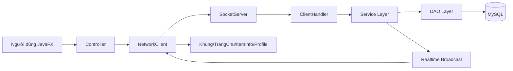
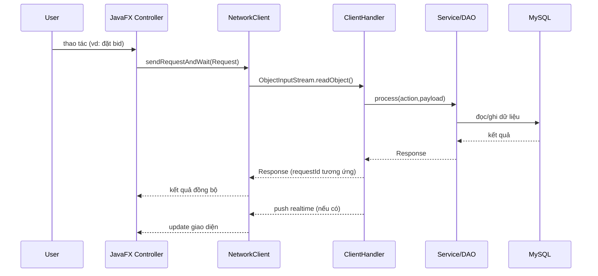

# Tài liệu Siêu Chi Tiết Codebase - Auction System JavaFX

Tài liệu này mô tả toàn bộ hệ thống theo trạng thái code hiện tại: kiến trúc, module, build/runtime, model dữ liệu, giao thức request/response, luồng nghiệp vụ, UI, realtime, DB/SQL, nền tảng đa luồng, rủi ro kỹ thuật, và checklist vận hành.

---

## 1) Tổng quan hệ thống

| Hạng mục | Mô tả |
|---|---|
| Loại hệ thống | Ứng dụng đấu giá trực tuyến theo mô hình Client-Server |
| Công nghệ chính | Java 25, JavaFX, Maven, MySQL, Socket TCP, JDBC |
| Cấu trúc repo | Multi-module Maven: `auction-shared`, `auction-server`, `auction-client` |
| Đặc điểm nổi bật | Đấu giá realtime, auto-bid, anti-sniping, dashboard admin, rating sau giao dịch |

---

## 2) Cấu trúc module và phụ thuộc

| Module | Vai trò | Phụ thuộc nổi bật |
|---|---|---|
| `auction-shared` | Chứa model dùng chung và protocol giao tiếp | Jackson, JUnit |
| `auction-server` | Business logic, socket server, DAO, scheduler | `auction-shared`, MySQL Connector/J |
| `auction-client` | JavaFX UI, điều hướng, network client | `auction-shared`, JavaFX controls/fxml/graphics |

### Build/Packaging

| Module | Cách chạy chính |
|---|---|
| Server | `mvn exec:java -Dexec.mainClass="com.auction.server.Main"` hoặc jar shade |
| Client | `mvn javafx:run` (`mainClass=com.auction.client.Main`) |
| Root | `mvn clean verify` |

---

## 3) Entry points và runtime boot sequence

| Thành phần | File | Vai trò |
|---|---|---|
| Client entry | `auction-client/src/main/java/com/auction/client/Main.java` | Mở `welcome.fxml` qua `SceneManager` |
| Client wrapper | `auction-client/src/main/java/com/auction/client/App.java` | Gọi `Main.main()` |
| Server entry | `auction-server/src/main/java/com/auction/server/Main.java` | Start `AuctionCloser` rồi mở `SocketServer` |
| Socket listener | `auction-server/src/main/java/com/auction/server/controller/SocketServer.java` | Listen port `8080`, pool 50 threads |

### Trình tự khởi chạy thực tế
1. Server khởi động -> scheduler đóng phiên chạy nền -> mở socket.
2. Client mở GUI -> user login/signup.
3. `NetworkClient` mở socket tới IP người dùng nhập + port `8080`.
4. Mọi nghiệp vụ truyền qua `Request/Response` dạng Java Serialization.

---

## 4) Bản đồ package server

| Package | Thành phần | Mục đích |
|---|---|---|
| `com.auction.server.controller` | `SocketServer`, `ClientHandler` | Nhận kết nối, route action |
| `com.auction.server.service` | `AuctionManager`, `BidService`, `SettlementService`, `AuctionCloser`, `UserService` | Nghiệp vụ đấu giá, user, scheduler |
| `com.auction.server.dao` | `DatabaseConnection`, `UserDao`, `ItemDao`, `BidDao`, `LotDao`, `RatingDao`, `TransactionLogDao` | Truy cập MySQL |

> Ghi chú: file `TransactionLogDao.java` đang nằm trong thư mục `service` nhưng package khai báo là `com.auction.server.dao`.

---

## 5) Bản đồ package client

| Package nhóm | Ví dụ file | Mục đích |
|---|---|---|
| Core app | `SceneManager`, `ClientSession`, `Main` | bootstrap, session, scene switching |
| Network | `network/NetworkClient.java` | gửi request đồng bộ + nghe push realtime |
| Auth controllers | `controller/LoginController`, `RegisterController`, `WelcomeController` | xác thực đầu vào UI |
| Main shell | `ui/Main/KhungController` | khung trang chính, sidebar, refresh |
| Auction flow | `ui/TrangChu`, `ui/ItemCard`, `ui/ItemInformation`, `ui/BiddingForm`, `ui/AddNewLot` | listing, chi tiết, đặt bid, tạo lot |
| User flow | `ui/Profile`, `ui/UserProfile`, `ui/TransactionHistory` | hồ sơ, avatar, nạp tiền, lịch sử |
| Admin flow | `ui/Main/AdminDashboardController` | quản lý user/item, thống kê |
| Utility | `app/NodeContentLoader`, `ulti/NotificationCenter` | load node, thông báo |

---

## 6) Mapping FXML -> Controller

| FXML | Controller |
|---|---|
| `/fxml/welcome.fxml` | `WelcomeController` |
| `/fxml/login.fxml` | `LoginController` |
| `/fxml/register.fxml` | `RegisterController` |
| `/fxml/main/Khung.fxml` | `KhungController` |
| `/fxml/searchbar/ThanhTimKiem.fxml` | `ThanhTimKiemController` |
| `/fxml/trangchu/TrangChu.fxml` | `TrangChuController` |
| `/fxml/itemcard/ItemCard.fxml` | `ItemCardController` |
| `/fxml/iteminformation/ItemInformation.fxml` | `ItemInformationController` |
| `/fxml/biddingform/BiddingForm.fxml` | `BiddingFormController` |
| `/fxml/ratingform/RatingForm.fxml` | `RatingFormController` |
| `/fxml/history/History.fxml` | `HistoryController` |
| `/fxml/history/TransactionHistory.fxml` | `TransactionHistoryController` |
| `/fxml/profile/Profile.fxml` | `ProfileController` |
| `/fxml/userprofile/UserProfile.fxml` | `UserProfileController` |
| `/fxml/youritem/YourItem.fxml` | `YourItemController` |
| `/fxml/addnewlot/AddNewLot.fxml` | `AddNewLotController` |
| `/fxml/main/AdminDashboard.fxml` | `AdminDashboardController` |

---

## 7) Shared model map (đối tượng dùng chung)

### 7.1 Giao thức

| Class | Trường chính | Vai trò |
|---|---|---|
| `Request` | `requestId`, `action`, `payload`, `timestamp` | Gói lệnh từ client lên server |
| `Response` | `requestId`, `status`, `message`, `payload`, `timestamp` | Gói phản hồi / event push |

`Response.OK = "SUCCESS"` và `Response.ERROR = "ERROR"`.

### 7.2 User domain

| Class | Ghi chú |
|---|---|
| `User` (abstract) | `username`, `fullName`, `password`, `email`, `phoneNumber`, `balance`, `active`, `locked`, `avatarUrl`, `moneySpent`, `itemsBought`, `moneyReceived`, `itemsSold`, `avgRating`, `totalRatings` |
| `Bidder` / `Seller` / `Admin` | Kế thừa `User`, khác nhau ở `getRole()` |
| `UserRole` | Enum role |

### 7.3 Auction domain

| Class | Trường chính |
|---|---|
| `Item` (abstract) | `name`, `description`, `startingPrice`, `currentPrice`, `maxPrice`, `startTime`, `endTime`, `sellerId`, `winnerId`, `status`, `imageUrl`, `sellerUsername`, `sellerAvatarUrl`, `category` |
| `Vehicle`, `Electronics`, `Art` | Item theo category + logic thuế riêng |
| `ItemFactory` | Tạo subclass item từ category |
| `ItemStatus` | `PENDING`, `OPEN`, `CLOSED`, `RUNNING`, `FINISHED`, `PAID`, `CANCELED` |
| `BidTransaction` | `itemId`, `userId`, `bidValue`, `timestamp`, `maxAutoBid`, `autoBid`, `autoBidIncrement` |
| `Lot` | DTO nhẹ cho listing/history (`title`, `bidValue`, thời gian, seller/winner info) |
| `Rating` | `itemId`, `raterUserId`, `ratedUserId`, `stars`, `feedback`, `createdAt` |
| `TransactionLog` | `userId`, `type`, `amount`, `itemId`, `createdAt` |

---

## 8) Request catalog đầy đủ (client -> server)

| Action | Nơi gọi từ client | Payload | Response payload thường gặp | DB tác động chính |
|---|---|---|---|---|
| `LOGIN` | `LoginController` | `Map(username,password)` | `User` | đọc `users` |
| `SIGNUP` | `RegisterController` | `Bidder` | null | đọc/ghi `users` |
| `LIST`, `GET_ONGOING_LOTS` | `TrangChuController`/khác | int userId hoặc null | `List<Item>` | đọc `items` |
| `GET_ONGOING_BIDS` | `TrangChuController`, `HistoryController` | int userId | `List<Lot>` | đọc `items/users` |
| `GET_UPCOMING_BIDS` | `HistoryController` | int userId | `List<Lot>` | đọc `items/users` |
| `getclosedbids`, `getpastbids` | `HistoryController` | int userId | `List<Lot>` | đọc `items/users` |
| `GET_ITEM_BY_ID` | `ItemInformationController` | int itemId | `Item` | đọc `items` |
| `get_bid_history` | `ItemInformationController` | int itemId | `List<BidTransaction>` | đọc `bid_transactions` |
| `BID` | `BiddingFormController`, `ItemInformationController` | `BidTransaction` | `BidTransaction`/itemId/null tùy nhánh | ghi users/items/bid/log |
| `ADD_LOT` | `AddNewLotController` | `Map<String,String>` | null | ghi `items` |
| `get_my_items` | `YourItemController`, `UserProfileController` | int sellerId | `List<Item>` | đọc `items` |
| `UPDATE_PROFILE` | `ClientSession` | `Map(userid,fullname,email,phone)` | null | ghi `users` |
| `UPDATE_AVATAR` | `ClientSession` | `"username avatarUrl"` | null | ghi `users` |
| `deposit` | `ProfileController` | `Map(userid,amount)` | `User` | ghi `users`, `transaction_logs` |
| `refresh_user` | `ProfileController` | int userId | `User` | đọc `users` |
| `get_transactions` | `TransactionHistoryController` | int userId | `List<TransactionLog>` | đọc `transaction_logs` |
| `SUBMIT_RATING` | `RatingFormController` | `Rating` | null | ghi `ratings`, `users` |
| `GET_RATINGS` | `ItemInformationController` | int itemId | `List<Rating>` | đọc `ratings/users` |
| `SEARCH_USERS` | `ThanhTimKiemController` | keyword | `List<User>` | đọc `users` |
| `GET_USER_BY_ID` | `UserProfileController` | int userId | `User` | đọc `users` |
| `GET_ALL_USERS` | `AdminDashboardController` | null | `List<User>` | đọc `users` |
| `LOCK_USER`, `UNLOCK_USER` | `AdminDashboardController` | username | null | ghi `users` |
| `PROMOTE_ADMIN` | `AdminDashboardController` | `"username:ROLE"` | null | ghi `users` |
| `GET_PENDING_ITEMS` | `AdminDashboardController` | null | `List<Item>` | đọc `items` |
| `APPROVE_ITEM`, `REJECT_ITEM` | `AdminDashboardController` | int itemId | null | ghi `items` |
| `get_status_stats`, `get_category_stats` | `AdminDashboardController` | null | `Map` | đọc `items` |
| `ping` | không thấy UI dùng | null | null | none |

---

## 9) Realtime event catalog (server push -> client listener)

| Status/Message | Phát từ đâu | Client xử lý |
|---|---|---|
| `BALANCE_UPDATE` | `AuctionManager`, `SettlementService` | cập nhật `ProfileController` hoặc `ClientSession` |
| `OUTBID_NOTIFY` | `AuctionManager` | thêm notification + popup |
| `NEW_BID_UPDATE` | `AuctionManager` | cập nhật giá realtime tại `KhungController` |
| `message=priceupdate` + payload `Item` | `AuctionManager` | fallback realtime update |
| `ITEM_CLOSED` | `SettlementService` | hiện chưa có nhánh dedicated trong `NetworkClient` |
| `message=closed` | `AuctionCloser` | đi vào luồng pending theo `requestId` (thường rỗng) |

---

## 10) Luồng nghiệp vụ chi tiết

### 10.1 Login/Register
1. User nhập form ở client.
2. `NetworkClient.sendRequestAndWait()` gửi request.
3. `ClientHandler.process()` route action.
4. `UserDao` đọc/ghi `users`.
5. Response trả về, client cập nhật `ClientSession`.

### 10.2 Tạo lot và duyệt lot
1. Seller gửi `ADD_LOT`.
2. `ItemDao.insertLot()` insert item `PENDING`.
3. Admin vào dashboard gọi `GET_PENDING_ITEMS`.
4. Admin chọn `APPROVE_ITEM` (`OPEN`) hoặc `REJECT_ITEM` (`CANCELED`).

### 10.3 Bid thường
1. Client gửi `BID`.
2. `AuctionManager.processBid()`:
   - check số điện thoại bidder.
   - check bidder không phải seller item.
   - trừ tiền bidder mới (`BID_HOLD`) và refund người dẫn cũ (`BID_REFUND`).
   - gọi `BidService.placeBid()` để insert bid + update giá.
   - kéo dài thời gian khi gần hết (anti-sniping).
3. Broadcast `NEW_BID_UPDATE`, gửi `OUTBID_NOTIFY` + `BALANCE_UPDATE`.

### 10.4 Auto-bid
1. `BidTransaction` có `autoBid=true`, `maxAutoBid`, `autoBidIncrement`.
2. Đăng ký vào queue theo item.
3. Sau mỗi lần giá thay đổi, hệ thống thử tự bid phản công cho user có trần cao hơn.

### 10.5 Buy-it-now (giá chạm max)
1. Nếu `bidValue >= maxPrice > 0`, xử lý nhánh mua ngay.
2. Trừ tiền buyer, cộng tiền seller, cập nhật metrics, ghi log.
3. Đóng item `CLOSED`, broadcast thành công.

### 10.6 Settlement theo thời gian
- `SettlementService`: item OPEN quá hạn -> đóng `CLOSED` hoặc `EXPIRED`, settlement seller, broadcast `ITEM_CLOSED`.
- `AuctionCloser`: item OPEN quá hạn + có winner -> đóng `FINISHED`, broadcast `closed`.

### 10.7 Rating
Điều kiện:
- phải login,
- item phải `CLOSED` hoặc `FINISHED`,
- người gửi là seller hoặc winner,
- chưa rating trước đó.

---

## 11) Ma trận SQL theo bảng

| Bảng | Đọc | Ghi |
|---|---|---|
| `users` | login/byId/all/search | signup, update profile/avatar, lock/unlock, role, balance, metrics, rating aggregate |
| `items` | all/byId/pending/expired/stats/bySeller | insert lot, update price/endtime, closeAuction, approve/reject |
| `bid_transactions` | by item, winner | insert bid |
| `transaction_logs` | by user | insert logs (deposit, hold/refund, sold/bought) |
| `ratings` | by item, hasRated, avg/count | create table, insert rating |

---

## 12) Đa luồng, đồng bộ, tài nguyên dùng chung

| Thành phần | Cơ chế hiện tại | Tác động |
|---|---|---|
| Socket server | fixed pool 50 | xử lý nhiều client song song |
| Client list | `CopyOnWriteArrayList` | an toàn khi iterate/broadcast |
| Auto-bid map | `ConcurrentHashMap<Integer, PriorityQueue<...>>` | map an toàn, queue con không thread-safe |
| `AuctionManager.processBid` | `synchronized` | đơn giản hóa race, nhưng giới hạn throughput |
| DB connection | singleton 1 `Connection` dùng chung | rủi ro race/transaction bleed cao |
| `BidDao.placeBid` | bật/tắt auto-commit trên shared connection | nguy cơ ảnh hưởng request khác |

---

## 13) Quyền truy cập và bảo mật hiện trạng

### 13.1 Action có check quyền rõ
- `PROMOTE_ADMIN`, `GET_PENDING_ITEMS`, `APPROVE_ITEM`, `REJECT_ITEM`, `get_status_stats`, `get_category_stats` -> yêu cầu current user admin.
- `SUBMIT_RATING` -> check login + participant + trạng thái item.

### 13.2 Action nhạy cảm chưa ràng buộc chặt
- `GET_ALL_USERS`, `LOCK_USER`, `UNLOCK_USER`, `UPDATE_PROFILE`, `deposit`, `get_transactions`, `refresh_user`, `get_my_items`, `ADD_LOT`, `BID`.

### 13.3 Điểm bảo mật khác
- password đang theo kiểu plain-text ở tầng query login.
- credentials DB hardcode trong source.
- login check `isactive` nhưng chưa check `islocked`.

---

## 14) Luồng UI chi tiết theo vai trò

| Vai trò | Màn chính | Hành động chính |
|---|---|---|
| Guest | Welcome/Login/Register | đăng nhập, đăng ký |
| Bidder | Trang chủ, Item detail, History, Profile | đặt bid, auto-bid, theo dõi giá, nạp tiền |
| Seller | AddNewLot, YourItem, History, Profile | tạo lot, theo dõi item của mình |
| Admin | AdminDashboard | duyệt item, khóa user, đổi role, xem thống kê |

> `ClientSession.toggleRole()` chỉ đổi role local trên client giữa BIDDER/SELLER; không phải đổi quyền thật ở DB.

---

## 15) Sơ đồ kiến trúc tổng thể

## 16) Sơ đồ request lifecycle

---

## 17) Checklist vận hành / debug nhanh

| Nhóm | Kiểm tra nhanh |
|---|---|
| Kết nối | Server đang nghe `8080`, client nhập đúng IP |
| DB | Kết nối `auction_db` thành công, table/cột đã có |
| Realtime | có nhận `NEW_BID_UPDATE`, `OUTBID_NOTIFY`, `BALANCE_UPDATE` |
| Auction close | theo dõi xung đột giữa `SettlementService` và `AuctionCloser` |
| Tài chính | so khớp `users.balance` với `transaction_logs` sau bid thất bại/thành công |
| Quyền | test admin endpoints với account không phải admin |

---

## 18) Danh mục tài liệu liên quan trong repo

| File | Nội dung |
|---|---|
| `docs/codebase-detailed-summary.md` | bản tóm tắt chi tiết ngắn hơn |
| `docs/user-interaction-db-matrix.md` | ma trận thao tác người dùng -> DB -> realtime |
| `README.md` | mô tả dự án và hướng chạy cơ bản |

---
