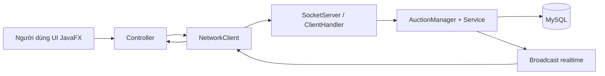

# Auction System JavaFX - Tóm tắt chi tiết

## 1) Kiến trúc tổng thể

| Phần | Vai trò | File/chỗ chính |
|---|---|---|
| `auction-client` | JavaFX UI, điều hướng màn hình, gọi server qua socket | `com.auction.client.Main`, `NetworkClient`, các controller `ui/*` |
| `auction-server` | Nhận request socket, xử lý nghiệp vụ, đọc/ghi MySQL, broadcast realtime | `SocketServer`, `ClientHandler`, `AuctionManager`, DAO |
| `auction-shared` | DTO/model dùng chung 2 phía (serialize qua socket) | `Request`, `Response`, `User`, `Item`, `BidTransaction`, enums |

## 2) Entry points và runtime flow

| Thành phần | Luồng chạy |
|---|---|
| Client startup | `Main.start()` -> `SceneManager.switchScene("/fxml/welcome.fxml")` |
| Server startup | `Main.main()` -> `AuctionCloser.start()` -> `SocketServer.startServer()` |
| Socket server | Mở cổng `8080`, thread pool 50, mỗi client gán `ClientHandler` |
| Protocol | Client gửi `Request(action,payload)`; server trả `Response(status,message,payload)` |

## 3) Ma trận action server (theo `ClientHandler.process`)

| Action | Service/DAO chain | Check quyền | Tác động dữ liệu / side effect | Response chính |
|---|---|---|---|---|
| `LOGIN` | `UserService.login -> UserDao.login` | Không | set `currentUser` trong handler | `SUCCESS success` / `ERROR fail` |
| `SIGNUP` | `UserService.signup -> UserDao.signup` | Không | insert user mới | `SUCCESS success` / `ERROR duplicate/server_error/class_cast_error` |
| `LIST`, `GET_ONGOING_LOTS` | `ItemDao.getAll` + filter `OPEN` | Không | read-only | `SUCCESS success + list` |
| `BID` | `AuctionManager.processBid -> BidService/ItemDao/UserDao/LogDao` | Không (dựa payload userId) | giữ tiền, hoàn tiền outbid, cập nhật giá, có thể đóng auction, broadcast realtime | theo nhánh bid |
| `ADD_LOT` | `handleAddLot -> ItemDao.insertLot` | Không role check seller | insert item `PENDING` | `SUCCESS` / `ERROR` |
| `get_my_items` | `ItemDao.getBySellerId` | Không | read-only | `SUCCESS + list` |
| `UPDATE_PROFILE` | `UserService.updateProfile -> UserDao.updateUserProfile` | Không ràng buộc owner | update thông tin user | `SUCCESS` / `ERROR` |
| `UPDATE_AVATAR` | `UserService.updateAvatar` | Không | update avatar url | `SUCCESS` / `ERROR` |
| `GET_ALL_USERS` | `UserService.getAllUsers` | Không admin check | đọc users | `SUCCESS + list` |
| `LOCK_USER`, `UNLOCK_USER` | `UserService.setUserLocked` | Không admin check | update `users.islocked` | `SUCCESS` / `ERROR` |
| `PROMOTE_ADMIN` | `UserService.setUserRole` | Có, current user phải ADMIN | update `users.role` | `SUCCESS` / `ERROR forbidden/fail` |
| `GET_ONGOING_BIDS`, `GET_UPCOMING_BIDS` | `LotDao.*` | Không | read-only | `SUCCESS + list` |
| `getclosedbids`, `getpastbids` | `LotDao.*` | Không | read-only | `SUCCESS + list` |
| `deposit` | `UserDao.getById/updateBalance` + `TransactionLogDao.insertLog` | Không ràng buộc owner | đổi số dư + ghi log `DEPOSIT` | `SUCCESS + user` / `ERROR` |
| `refresh_user` | `UserDao.getById` | Không | read-only | `SUCCESS + user` / `ERROR` |
| `get_transactions` | `TransactionLogDao.getByUserId` | Không | read-only | `SUCCESS + list` |
| `GET_ITEM_BY_ID` | `ItemDao.getById` | Không | read-only | `SUCCESS + item` / `ERROR not_found` |
| `SUBMIT_RATING` | `handleSubmitRating -> RatingDao` | Có: login + participant + item ended | insert rating + recalc user rating | `SUCCESS` / `ERROR ...` |
| `GET_RATINGS` | `RatingDao.getByItemId` | Không | read-only | `SUCCESS + list` |
| `GET_PENDING_ITEMS` | `ItemDao.getPendingItems` | Có admin | read-only | `SUCCESS + list` / `ERROR forbidden` |
| `APPROVE_ITEM`, `REJECT_ITEM` | `ItemDao.approveItem/rejectItem` | Có admin | đổi status item | `SUCCESS` / `ERROR forbidden/fail` |
| `SEARCH_USERS` | `UserDao.searchUsers` | Không | read-only | `SUCCESS + list` |
| `GET_USER_BY_ID` | `UserDao.getById` + clear password | Không | read-only | `SUCCESS + user` / `ERROR not_found` |
| `get_status_stats`, `get_category_stats` | `ItemDao.*Stats` | Có admin | read-only | `SUCCESS + map` / `ERROR forbidden` |
| `get_bid_history` | query trực tiếp trong `ClientHandler` | Không | read-only | `SUCCESS + list` |
| `ping` | none | Không | none | `SUCCESS pong` |

## 4) Nghiệp vụ đấu giá (core behavior)

| Tình huống | Hành vi hiện tại |
|---|---|
| Bid thường | Trừ tiền bidder mới (`BID_HOLD`) -> hoàn bidder cũ (`BID_REFUND`) -> `placeBid` -> broadcast |
| Auto-bid | Đăng ký queue theo `maxAutoBid`, sau mỗi bid thử counter-bid |
| Anti-sniping | Nếu còn <60s, kéo dài thêm 60s |
| Buy-it-now | Nếu bid >= `maxPrice`, trừ buyer, cộng seller, đóng `CLOSED`, broadcast |
| Auction hết hạn | Có 2 scheduler chạy song song (`SettlementService`, `AuctionCloser`) |

## 5) Ma trận UI client (FXML -> controller -> request)

| Màn hình/khối | Controller | Request gửi |
|---|---|---|
| Welcome/Login/Register | `WelcomeController`, `LoginController`, `RegisterController` | `LOGIN`, `SIGNUP` |
| Khung chính | `KhungController` | điều hướng nội bộ |
| Trang chủ | `TrangChuController` | `GET_ONGOING_BIDS` |
| Item detail | `ItemInformationController` | `GET_ITEM_BY_ID`, `get_bid_history`, `GET_RATINGS`, `BID` |
| Bid form | `BiddingFormController` | `BID` |
| Rating form | `RatingFormController` | `SUBMIT_RATING` |
| History | `HistoryController` | `GET_ONGOING_BIDS`, `GET_UPCOMING_BIDS`, `getclosedbids`, `getpastbids` |
| Your items | `YourItemController` | `get_my_items` |
| Profile | `ProfileController`, `ClientSession` | `deposit`, `refresh_user`, `UPDATE_PROFILE`, `UPDATE_AVATAR` |
| User profile | `UserProfileController` | `GET_USER_BY_ID`, `get_my_items` |
| Admin dashboard | `AdminDashboardController` | `GET_ALL_USERS`, `GET_PENDING_ITEMS`, `LOCK/UNLOCK`, `PROMOTE_ADMIN`, `APPROVE/REJECT`, stats |
| Search bar | `ThanhTimKiemController` | `SEARCH_USERS` |

## 6) Realtime events client đang xử lý

| Event status/message | Client xử lý |
|---|---|
| `BALANCE_UPDATE` | cập nhật `ProfileController` hoặc `ClientSession` |
| `OUTBID_NOTIFY` | đẩy notification |
| `NEW_BID_UPDATE` hoặc `message=priceupdate` | cập nhật giá realtime trong `KhungController` |
| `ITEM_CLOSED` | chưa có nhánh xử lý riêng trong `NetworkClient` |

## 7) Dữ liệu và persistence

| Thành phần | Trạng thái hiện tại |
|---|---|
| DB | MySQL `auction_db` |
| Kết nối | hardcode trong `DatabaseConnection` (`url/user/pass`) |
| Bảng chính | `users`, `items`, `bid_transactions`, `transaction_logs`, `ratings` |
| Runtime migrations | DAO tự `ALTER TABLE`/`CREATE INDEX` nếu thiếu cột/index |

## 8) Sơ đồ luồng tổng quan

