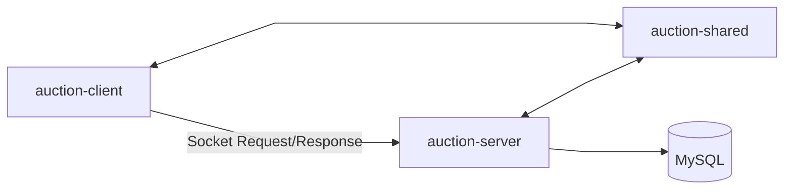
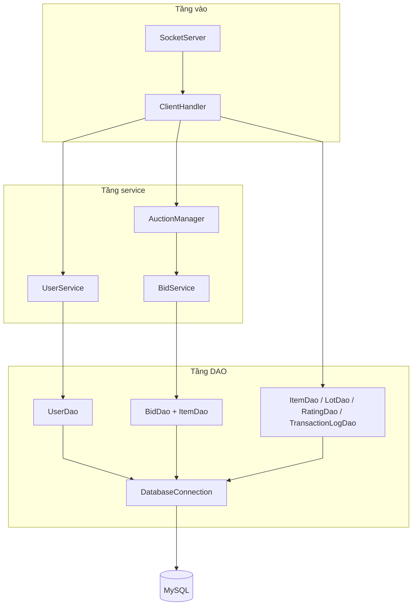
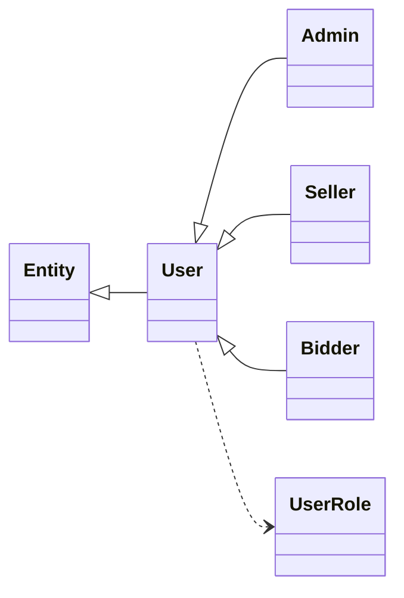
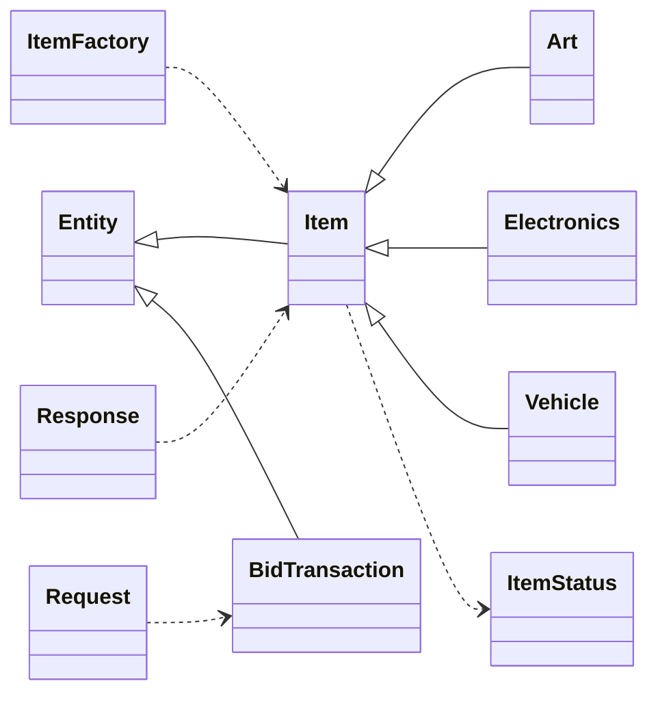
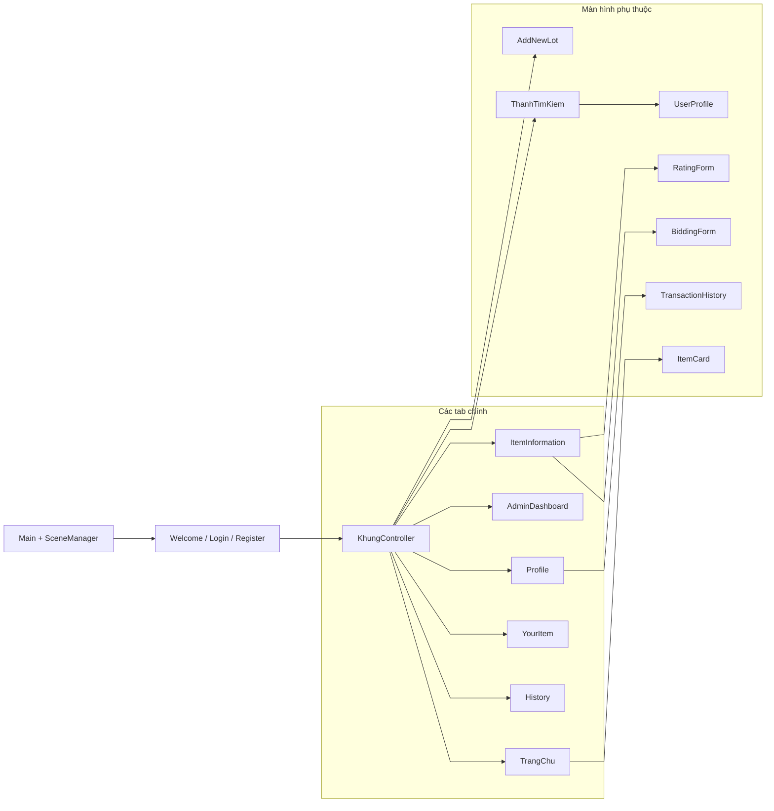
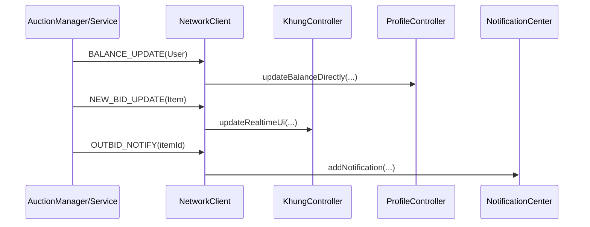

# UML Bản Dễ Đọc (Giảm Rối)

Tài liệu này là phiên bản UML tinh gọn để đọc nhanh.  
Bản đầy đủ vẫn nằm ở: `docs/project-uml-complete.md`.

---

## Cách đọc đề xuất

1. Xem **Sơ đồ 1** để nắm kiến trúc tổng thể.
2. Xem **Sơ đồ 2** để hiểu luồng request server.
3. Xem **Sơ đồ 3A/3B** để hiểu model dùng chung.
4. Xem **Sơ đồ 4** để hiểu client UI.
5. Xem **Sơ đồ 5** để hiểu realtime.

> Nguyên tắc giảm rối: sơ đồ tổng quan **không nhét tất cả method**.  
> Method chi tiết xem ở file full.

---

## Sơ đồ 1 - Kiến trúc liên module

---

## Sơ đồ 2 - Server request pipeline

---

## Sơ đồ 3 - Shared domain model (tách 2 cụm để đỡ chồng)

### Sơ đồ 3A - User hierarchy

### Sơ đồ 3B - Item + protocol core

---

## Sơ đồ 4 - Client UI orchestration

---

## Sơ đồ 5 - Realtime events

---

## Bảng chỉ mục class theo nhóm (để tìm nhanh)

| Nhóm | Class chính |
|---|---|
| Shared Core | `Entity`, `User`, `Item`, `BidTransaction`, `Request`, `Response` |
| Shared Subtypes | `Admin`, `Seller`, `Bidder`, `Art`, `Electronics`, `Vehicle` |
| Server Entry | `Main`, `SocketServer`, `ClientHandler` |
| Server Service | `AuctionManager`, `BidService`, `SettlementService`, `AuctionCloser`, `UserService` |
| Server DAO | `DatabaseConnection`, `UserDao`, `ItemDao`, `BidDao`, `LotDao`, `RatingDao`, `TransactionLogDao` |
| Client Core | `Main`, `SceneManager`, `ClientSession`, `NetworkClient` |
| Client Controllers | `KhungController`, `TrangChuController`, `ItemInformationController`, `ProfileController`, `AdminDashboardController`, `HistoryController`, `YourItemController`, `AddNewLotController`, `ThanhTimKiemController` |

---

## Khi nào dùng bản nào

- Dùng `project-uml-clean.md`: đọc nhanh, onboarding, review kiến trúc.
- Dùng `project-uml-complete.md`: tra cứu đầy đủ method/visibility.

