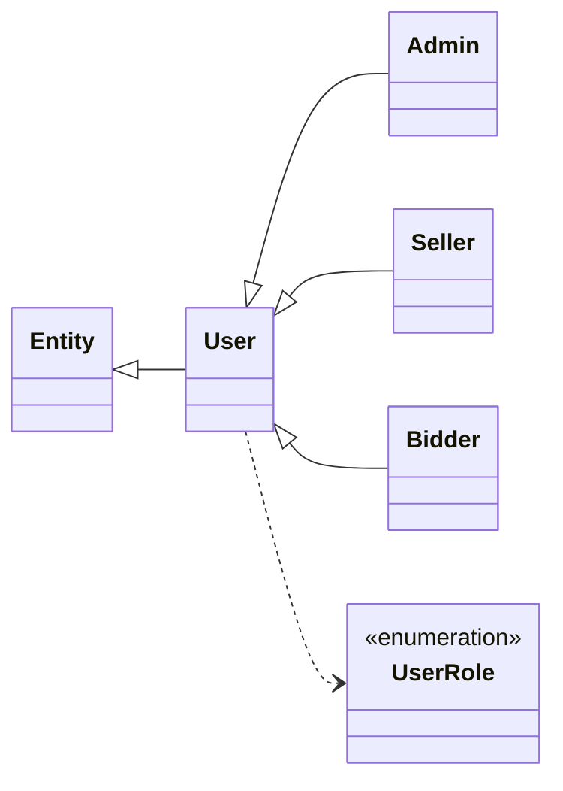
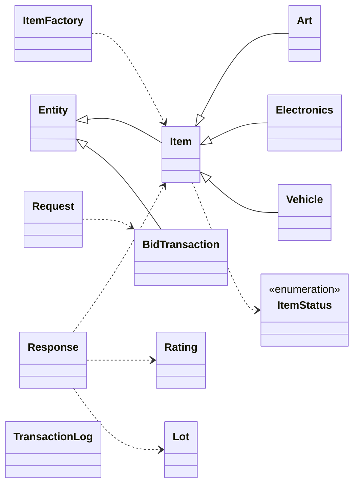
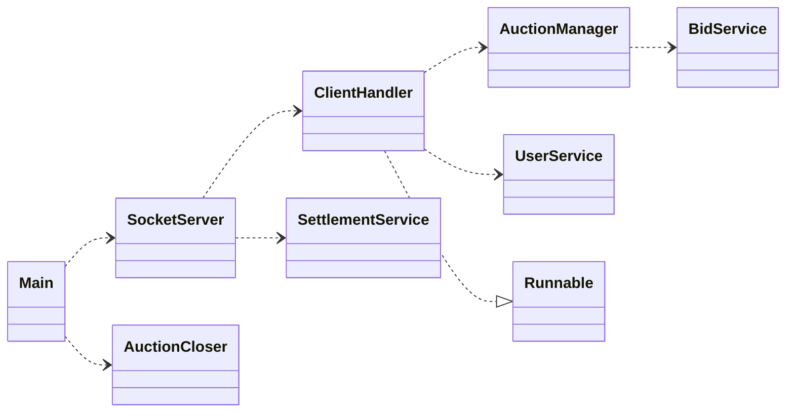
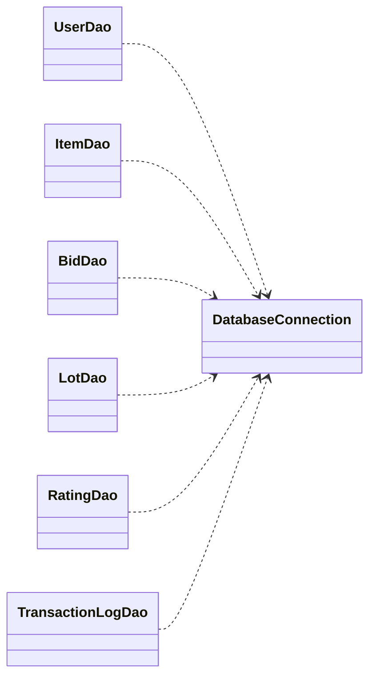
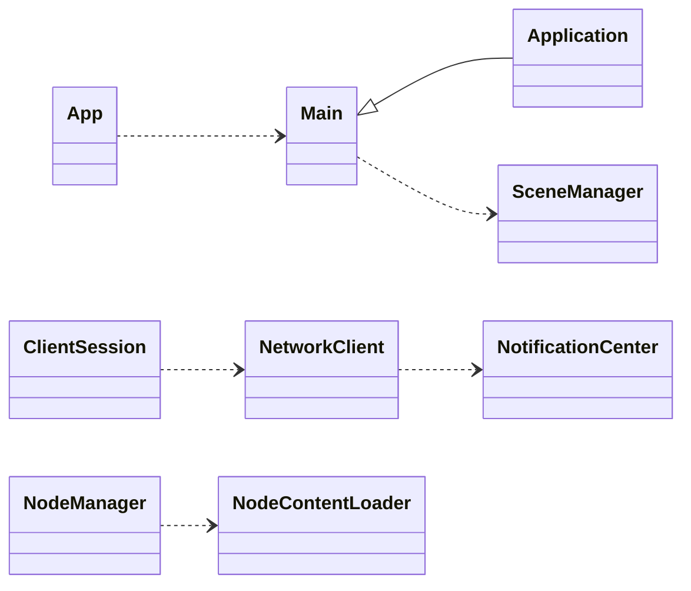
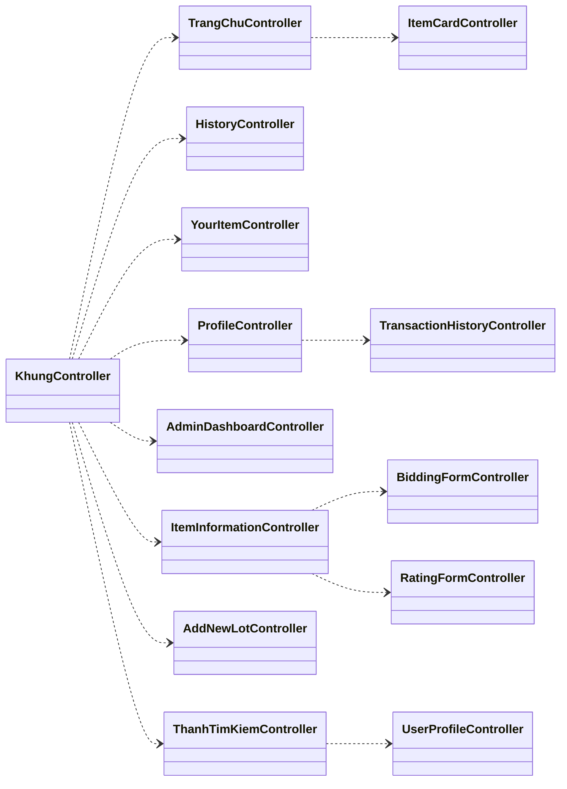
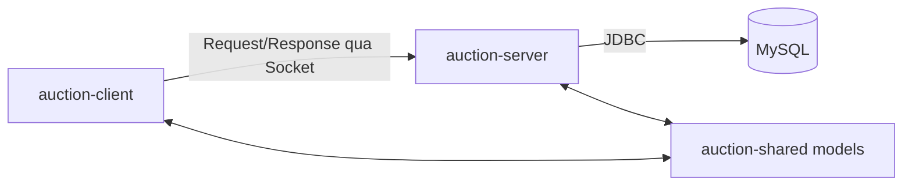

# UML Toàn Bộ Project (Chi Tiết)

Tài liệu này mô tả UML cho toàn bộ codebase theo 3 module: `auction-shared`, `auction-server`, `auction-client`.

## Quy ước ký hiệu

- `+`: `public`
- `-`: `private`
- `#`: `protected`
- `~`: package-private

---

## 1) UML module `auction-shared`

## 1.1 Inventory class/interface/enum và method

### `com.auction.shared.Entity` (abstract class)
- Fields:
  - `- serialVersionUID: long {static final}`
  - `# id: int`
  - `# version: int`
- Methods:
  - `+ getId(): int`
  - `+ setId(id: int): void`
  - `+ getVersion(): int`
  - `+ setVersion(v: int): void`

### `com.auction.shared.User` (abstract class, extends `Entity`)
- Fields:
  - `# username: String`
  - `# fullName: String`
  - `# password: String`
  - `# email: String`
  - `# age: String`
  - `# phoneNumber: String`
  - `# balance: double`
  - `# active: boolean`
  - `# locked: boolean`
  - `# avatarUrl: String`
  - `# moneySpent: double`
  - `# itemsBought: int`
  - `# moneyReceived: double`
  - `# itemsSold: int`
  - `# avgRating: double`
  - `# totalRatings: int`
- Methods:
  - `+ User()`
  - `+ User(u: String, p: String, e: String, a: String, ph: String)`
  - `+ getRole(): UserRole {abstract}`
  - `+ getUsername(): String`
  - `+ setUsername(u: String): void`
  - `+ getFullName(): String`
  - `+ setFullName(ans: String): void`
  - `+ getPassword(): String`
  - `+ setPassword(p: String): void`
  - `+ getEmail(): String`
  - `+ setEmail(e: String): void`
  - `+ getAge(): String`
  - `+ setAge(a: String): void`
  - `+ getPhoneNumber(): String`
  - `+ setPhoneNumber(ph: String): void`
  - `+ getBalance(): double`
  - `+ setBalance(b: double): void`
  - `+ isActive(): boolean`
  - `+ setActive(a: boolean): void`
  - `+ isLocked(): boolean`
  - `+ setLocked(l: boolean): void`
  - `+ getAvatarUrl(): String`
  - `+ setAvatarUrl(ans: String): void`
  - `+ getMoneySpent(): double`
  - `+ setMoneySpent(m: double): void`
  - `+ getItemsBought(): int`
  - `+ setItemsBought(i: int): void`
  - `+ getMoneyReceived(): double`
  - `+ setMoneyReceived(m: double): void`
  - `+ getItemsSold(): int`
  - `+ setItemsSold(i: int): void`
  - `+ getAvgRating(): double`
  - `+ setAvgRating(r: double): void`
  - `+ getTotalRatings(): int`
  - `+ setTotalRatings(r: int): void`

### `com.auction.shared.Admin` (class, extends `User`)
- Methods:
  - `+ Admin()`
  - `+ Admin(u: String, p: String, e: String, a: String, ph: String)`
  - `+ getRole(): UserRole`

### `com.auction.shared.Seller` (class, extends `User`)
- Methods:
  - `+ Seller()`
  - `+ Seller(u: String, p: String, e: String, a: String, ph: String)`
  - `+ getRole(): UserRole`

### `com.auction.shared.Bidder` (class, extends `User`)
- Methods:
  - `+ Bidder()`
  - `+ Bidder(u: String, p: String, e: String, a: String, ph: String)`
  - `+ getRole(): UserRole`

### `com.auction.shared.UserRole` (enum)
- Literals: `BIDDER`, `SELLER`, `ADMIN`

### `com.auction.shared.Item` (abstract class, extends `Entity`)
- Fields:
  - `# name: String`
  - `# description: String`
  - `# startingPrice: double`
  - `# currentPrice: double`
  - `# startTime: LocalDateTime`
  - `# endTime: LocalDateTime`
  - `# maxPrice: double`
  - `# sellerId: int`
  - `# winnerId: int`
  - `# status: ItemStatus`
  - `# imageUrl: String`
  - `# sellerUsername: String`
  - `# sellerAvatarUrl: String`
  - `# category: String`
- Methods:
  - `+ Item()`
  - `+ Item(res: String, ans: String, res1: double, ans1: double, res2: int)`
  - `+ calculateTax(): double {abstract}`
  - `+ getCategory(): String`
  - `+ setCategory(res: String): void`
  - `+ getName(): String`
  - `+ setName(res: String): void`
  - `+ getDescription(): String`
  - `+ setDescription(res: String): void`
  - `+ getStartingPrice(): double`
  - `+ setStartingPrice(res: double): void`
  - `+ getCurrentPrice(): double`
  - `+ setCurrentPrice(res: double): void`
  - `+ getStartTime(): LocalDateTime`
  - `+ setStartTime(res: LocalDateTime): void`
  - `+ getEndTime(): LocalDateTime`
  - `+ setEndTime(res: LocalDateTime): void`
  - `+ getMaxPrice(): double`
  - `+ setMaxPrice(res: double): void`
  - `+ getSellerId(): int`
  - `+ setSellerId(res: int): void`
  - `+ getWinnerId(): int`
  - `+ setWinnerId(res: int): void`
  - `+ getStatus(): ItemStatus`
  - `+ setStatus(res: ItemStatus): void`
  - `+ getImageUrl(): String`
  - `+ setImageUrl(res: String): void`
  - `+ getSellerUsername(): String`
  - `+ setSellerUsername(res: String): void`
  - `+ getSellerAvatarUrl(): String`
  - `+ setSellerAvatarUrl(res: String): void`

### `com.auction.shared.Art` (class, extends `Item`)
- Methods:
  - `+ Art()`
  - `+ Art(res: String, ans: String, res1: double, ans1: double, res2: int)`
  - `+ getCategory(): String`
  - `+ calculateTax(): double`

### `com.auction.shared.Electronics` (class, extends `Item`)
- Methods:
  - `+ Electronics()`
  - `+ Electronics(res: String, ans: String, res1: double, ans1: double, res2: int)`
  - `+ getCategory(): String`
  - `+ calculateTax(): double`

### `com.auction.shared.Vehicle` (class, extends `Item`)
- Methods:
  - `+ Vehicle()`
  - `+ Vehicle(res: String, ans: String, res1: double, ans1: double, res2: int)`
  - `+ getCategory(): String`
  - `+ calculateTax(): double`

### `com.auction.shared.ItemStatus` (enum)
- Literals: `PENDING`, `OPEN`, `CLOSED`, `RUNNING`, `FINISHED`, `PAID`, `CANCELED`

### `com.auction.shared.ItemFactory` (class)
- Methods:
  - `+ createItem(res: String): Item {static}`

### `com.auction.shared.BidTransaction` (class, extends `Entity`)
- Fields:
  - `# itemId: int`
  - `# userId: int`
  - `# bidValue: double`
  - `# timestamp: LocalDateTime`
  - `# maxAutoBid: double`
  - `# autoBid: boolean`
  - `# autoBidIncrement: double`
- Methods:
  - `+ BidTransaction()`
  - `+ BidTransaction(res: int, ans: int, res1: double)`
  - `+ getItemId(): int`
  - `+ setItemId(res: int): void`
  - `+ getUserId(): int`
  - `+ setUserId(ans: int): void`
  - `+ getBidValue(): double`
  - `+ setBidValue(res: double): void`
  - `+ getTimestamp(): LocalDateTime`
  - `+ setTimestamp(ans: LocalDateTime): void`
  - `+ getMaxAutoBid(): double`
  - `+ setMaxAutoBid(res: double): void`
  - `+ isAutoBid(): boolean`
  - `+ setAutoBid(ans: boolean): void`
  - `+ getAutoBidIncrement(): double`
  - `+ setAutoBidIncrement(res: double): void`

### `com.auction.shared.Lot` (class, implements `Serializable`)
- Fields:
  - `- id: int`
  - `- itemId: int`
  - `- title: String`
  - `- description: String`
  - `- bidValue: double`
  - `- startTime: LocalDateTime`
  - `- endTime: LocalDateTime`
  - `- imageUrl: String`
  - `- sellerUsername: String`
  - `- sellerAvatarUrl: String`
  - `- winnerUsername: String`
- Methods:
  - `+ Lot()`
  - `+ getId(): int`
  - `+ setId(i: int): void`
  - `+ getItemId(): int`
  - `+ setItemId(i: int): void`
  - `+ getTitle(): String`
  - `+ setTitle(t: String): void`
  - `+ getDescription(): String`
  - `+ setDescription(d: String): void`
  - `+ getBidValue(): double`
  - `+ setBidValue(v: double): void`
  - `+ getStartTime(): LocalDateTime`
  - `+ setStartTime(t: LocalDateTime): void`
  - `+ getEndTime(): LocalDateTime`
  - `+ setEndTime(t: LocalDateTime): void`
  - `+ getImageUrl(): String`
  - `+ setImageUrl(u: String): void`
  - `+ getSellerUsername(): String`
  - `+ setSellerUsername(s: String): void`
  - `+ getSellerAvatarUrl(): String`
  - `+ setSellerAvatarUrl(s: String): void`
  - `+ getWinnerUsername(): String`
  - `+ setWinnerUsername(w: String): void`

### `com.auction.shared.Rating` (class, implements `Serializable`)
- Fields:
  - `- id: int`
  - `- itemId: int`
  - `- raterUserId: int`
  - `- ratedUserId: int`
  - `- stars: int`
  - `- feedback: String`
  - `- createdAt: LocalDateTime`
  - `- raterUsername: String`
- Methods:
  - `+ Rating()`
  - `+ Rating(itemId: int, raterUserId: int, ratedUserId: int, stars: int, feedback: String)`
  - `+ getId(): int`
  - `+ setId(id: int): void`
  - `+ getItemId(): int`
  - `+ setItemId(res: int): void`
  - `+ getRaterUserId(): int`
  - `+ setRaterUserId(res: int): void`
  - `+ getRatedUserId(): int`
  - `+ setRatedUserId(res: int): void`
  - `+ getStars(): int`
  - `+ setStars(res: int): void`
  - `+ getFeedback(): String`
  - `+ setFeedback(res: String): void`
  - `+ getCreatedAt(): LocalDateTime`
  - `+ setCreatedAt(res: LocalDateTime): void`
  - `+ getRaterUsername(): String`
  - `+ setRaterUsername(res: String): void`

### `com.auction.shared.Request` (class, implements `Serializable`)
- Fields: constants action + `# requestId`, `# action`, `# payload`, `# timestamp`
- Methods:
  - `+ Request(act: String, obj: Object)`
  - `+ getRequestId(): String`
  - `+ getAction(): String`
  - `+ getPayload(): Object`
  - `+ getTimestamp(): LocalDateTime`

### `com.auction.shared.Response` (class, implements `Serializable`)
- Fields: `+ OK`, `+ ERROR`, `# requestId`, `# status`, `# message`, `# payload`, `# timestamp`
- Methods:
  - `+ Response(rid: String, st: String, msg: String, obj: Object)`
  - `+ getRequestId(): String`
  - `+ getStatus(): String`
  - `+ getMessage(): String`
  - `+ getPayload(): Object`
  - `+ getTimestamp(): LocalDateTime`

### `com.auction.shared.TransactionLog` (class, implements `Serializable`)
- Fields:
  - `- id: int`
  - `- userId: int`
  - `- type: String`
  - `- amount: double`
  - `- itemId: int`
  - `- createdAt: LocalDateTime`
- Methods:
  - `+ TransactionLog()`
  - `+ TransactionLog(u: int, t: String, a: double, i: int, c: LocalDateTime)`
  - `+ getId(): int`
  - `+ setId(res: int): void`
  - `+ getUserId(): int`
  - `+ setUserId(res: int): void`
  - `+ getType(): String`
  - `+ setType(res: String): void`
  - `+ getAmount(): double`
  - `+ setAmount(res: double): void`
  - `+ getItemId(): int`
  - `+ setItemId(res: int): void`
  - `+ getCreatedAt(): LocalDateTime`
  - `+ setCreatedAt(res: LocalDateTime): void`

## 1.2 Mermaid classDiagram (`auction-shared`) - Bản tách cụm dễ đọc

### 1.2.1 User hierarchy



### 1.2.2 Item hierarchy + protocol core



---

## 2) UML module `auction-server`

## 2.1 Inventory class và method

### `com.auction.server.Main`
- Methods:
  - `+ main(String[] args): void`

### `com.auction.server.controller.SocketServer`
- Fields:
  - `- port: int`
  - `- pool: ExecutorService`
- Methods:
  - `+ SocketServer(int p)`
  - `+ startServer(): void`

### `com.auction.server.controller.ClientHandler` (`implements Runnable`)
- Fields:
  - `- socket: Socket`
  - `- out: ObjectOutputStream`
  - `- in: ObjectInputStream`
  - `- userService: UserService`
  - `- itemDao: ItemDao`
  - `- lotDao: LotDao`
  - `- logDao: TransactionLogDao`
  - `- ratingDao: RatingDao`
  - `- currentUser: User`
- Methods:
  - `+ ClientHandler(Socket s)`
  - `+ getCurrentUser(): User`
  - `+ run(): void`
  - `- process(Request req): Response`
  - `- handleSubmitRating(Request req): Response`
  - `- handleAddLot(Request req): Response`
  - `- handleDeposit(Request req): Response`
  - `+ send(Response r): void`

### `com.auction.server.service.UserService`
- Fields: `- userDao: UserDao`
- Methods:
  - `+ UserService()`
  - `+ login(String u, String p): User`
  - `+ signup(User u): boolean`
  - `+ updateProfile(int userId, String fullName, String email, String phone): String`
  - `+ updateAvatar(String username, String ans): void throws Exception`
  - `+ getAllUsers(): List<User>`
  - `+ setUserLocked(String username, boolean lockStatus): boolean`
  - `+ setUserRole(String username, String role): boolean`

### `com.auction.server.service.BidService`
- Fields:
  - `- itemDao: ItemDao`
  - `- bidDao: BidDao`
- Methods:
  - `+ BidService()`
  - `+ placeBid(BidTransaction b): Response`

### `com.auction.server.service.AuctionManager` (Singleton)
- Fields:
  - `- instance: AuctionManager {static}`
  - `- clients: List<ClientHandler>`
  - `- bidservice: BidService`
  - `- itemDao: ItemDao`
  - `- userDao: UserDao`
  - `- logDao: TransactionLogDao`
  - `- autobids: Map<Integer, PriorityQueue<BidTransaction>>`
- Methods:
  - `- AuctionManager()`
  - `+ getInstance(): AuctionManager {static synchronized}`
  - `+ addClient(ClientHandler c): void`
  - `+ removeClient(ClientHandler c): void`
  - `+ processBid(BidTransaction b): Response {synchronized}`
  - `- registerAutoBidQueue(BidTransaction b): void`
  - `- tryProcessAutoCounters(int itemId): void`
  - `- getPreviousHighestBidder(int id): int`
  - `+ sendToUser(int id, Response r): void`
  - `+ broadcast(Response r): void`

### `com.auction.server.service.AuctionCloser`
- Fields:
  - `- itemDao: ItemDao`
  - `- bidDao: BidDao`
  - `- scheduler: ScheduledExecutorService`
- Methods:
  - `+ AuctionCloser()`
  - `+ start(): void`

### `com.auction.server.service.SettlementService`
- Fields:
  - `- itemDao: ItemDao`
  - `- userDao: UserDao`
  - `- logDao: TransactionLogDao`
- Methods:
  - `+ SettlementService()`
  - `+ start(): void`
  - `- settle(Item res): void`
  - `- getWinnerId(int id): int`

### `com.auction.server.dao.DatabaseConnection` (Singleton)
- Fields:
  - `- instance: DatabaseConnection {static}`
  - `- connection: Connection`
  - `- url: String`
  - `- user: String`
  - `- pass: String`
- Methods:
  - `- DatabaseConnection()`
  - `+ getInstance(): DatabaseConnection {static}`
  - `+ getConnection(): Connection`

### `com.auction.server.dao.UserDao`
- Fields: `- conn: Connection`
- Methods:
  - `+ UserDao()`
  - `- ensureProfileColumns(): void`
  - `+ login(String u, String p): User`
  - `+ signup(User u): boolean`
  - `- ensureUniqueIndexes(): void`
  - `- indexExists(String tableName, String indexName): boolean`
  - `- columnExists(String tableName, String columnName): boolean`
  - `- existsDuplicateUser(String username, String email): boolean`
  - `- normalize(String value): String`
  - `+ updateUserProfile(int userId, String fullName, String email, String phone): String`
  - `- emailTakenByOtherUser(int userId, String email): boolean`
  - `- phoneTakenByOtherUser(int userId, String phone): boolean`
  - `+ updateAvatar(String username, String ans): void throws Exception`
  - `+ setUserLocked(String username, boolean lockStatus): boolean`
  - `+ setUserRole(String username, String role): boolean`
  - `+ getAllUsers(): List<User>`
  - `+ updateBalance(int id, double b): boolean`
  - `+ addBidderMetrics(int userId, double amount): boolean`
  - `+ addSellerMetrics(int userId, double amount): boolean`
  - `+ searchUsers(String keyword): List<User>`
  - `+ getById(String id): User`

### `com.auction.server.dao.ItemDao`
- Fields: `- conn: Connection`
- Methods:
  - `+ ItemDao()`
  - `- ensureColumns(): void`
  - `- columnExists(String res, String ans): boolean`
  - `+ getAll(): List<Item>`
  - `+ getById(int res): Item`
  - `+ updatePrice(int res, double ans, int res1): boolean`
  - `+ updateEndTime(int res, LocalDateTime ans): boolean`
  - `+ insertLot(String res, String ans, double res1, double ans1, LocalDateTime res2, LocalDateTime ans2, String res3, String ans3, String res4): boolean`
  - `+ closeAuction(int res, int ans, String res1): void`
  - `- mapResultSet(ResultSet res): Item`
  - `+ getExpiredItems(): List<Item>`
  - `+ getBySellerId(int res): List<Item>`
  - `+ getPendingItems(): List<Item>`
  - `+ approveItem(int res): boolean`
  - `+ rejectItem(int res): boolean`
  - `+ getStatusStats(): HashMap<String,Integer>`
  - `+ getCategoryStats(): HashMap<String,Double>`

### `com.auction.server.dao.BidDao`
- Fields: `- conn: Connection`
- Methods:
  - `+ BidDao()`
  - `+ placeBid(BidTransaction b): boolean`
  - `+ addBid(BidTransaction b): boolean`
  - `+ getByItem(int iid): List<BidTransaction>`
  - `+ getWinner(int iid): BidTransaction`

### `com.auction.server.dao.LotDao`
- Fields: `- conn: Connection`
- Methods:
  - `+ LotDao()`
  - `+ getOngoingBids(int userId): List<Lot>`
  - `+ getUpcomingBids(int userId): List<Lot>`
  - `+ getClosedBids(int userId): List<Lot>`
  - `+ getPastBids(int userId): List<Lot>`
  - `- mapResultSet(ResultSet rs): Lot`

### `com.auction.server.dao.RatingDao`
- Fields: `- conn: Connection`
- Methods:
  - `+ RatingDao()`
  - `- ensureTable(): void`
  - `+ insertRating(Rating r): boolean`
  - `+ hasRated(int itemId, int userId): boolean`
  - `+ getByItemId(int itemId): List<Rating>`
  - `+ recalcUserRating(int userId): void`

### `com.auction.server.dao.TransactionLogDao`
- Fields: `- conn: Connection`
- Methods:
  - `+ TransactionLogDao()`
  - `+ insertLog(int u, String t, double a, int i): boolean`
  - `+ getByUserId(int u): List<TransactionLog>`

## 2.2 Mermaid UML (`auction-server`) - Bản tách cụm dễ đọc

### 2.2.1 Pipeline kiến trúc server

```mermaid
%%{init: {'flowchart': {'curve': 'linear', 'nodeSpacing': 80, 'rankSpacing': 90}} }%%
flowchart TB
  Main --> SocketServer
  Main --> AuctionCloser
  SocketServer --> ClientHandler
  SocketServer --> SettlementService

  ClientHandler --> UserService
  ClientHandler --> AuctionManager
  ClientHandler --> "ItemDao / LotDao / RatingDao / TransactionLogDao"

  AuctionManager --> BidService
  UserService --> UserDao
  BidService --> "BidDao + ItemDao"
```

### 2.2.2 Class diagram service/controller core



### 2.2.3 Class diagram DAO layer



---

## 3) UML module `auction-client`

## 3.1 Danh mục class và method (27 class)

## `com.auction.client`

### `Main` (`extends Application`)
- Methods:
  - `+ start(primaryStage: Stage): void throws Exception`
  - `+ main(args: String[]): void {static}`

### `App`
- Methods:
  - `+ main(args: String[]): void {static}`

### `SceneManager`
- Fields:
  - `- rootStage: Stage {static}`
  - `- GLOBAL_STYLE: String {static final}`
- Methods:
  - `+ setStage(stage: Stage): void {static}`
  - `+ getStage(): Stage {static}`
  - `+ switchScene(fxmlPath: String): void throws IOException {static}`

### `ClientSession` (`final`)
- Fields:
  - `- currentUser: User {static}`
  - `- fullName: String {static}`
  - `- email: String {static}`
  - `- phone: String {static}`
  - `- activeRole: UserRole {static}`
- Methods:
  - `- ClientSession()`
  - `+ setCurrentUser(user: User): void {static}`
  - `+ getCurrentUser(): User {static}`
  - `+ getUsername(): String {static}`
  - `+ getFullName(): String {static}`
  - `+ getEmail(): String {static}`
  - `+ getPhone(): String {static}`
  - `+ getActiveRole(): UserRole {static}`
  - `+ updateProfile(newFullName: String, newEmail: String, newPhone: String): String {static}`
  - `+ updateAvatar(ans: String): void {static}`
  - `+ toggleRole(): void {static}`
  - `+ clear(): void {static}`
  - `- safe(value: String): String {static}`

## `com.auction.client.app`

### `NodeManager`
- Methods:
  - `+ addNodeToPane(loader: NodeContentLoader<?>, backGroundFrame: Pane): void {static}`
  - `+ switchNodewithNode(node1: Node, node2: Node, backGroundFrame: Pane): void {static}`
  - `+ removeNodeFromPane(node1: Node, backGroundFrame: Pane): void {static}`

### `NodeContentLoader<T extends Node>`
- Fields:
  - `- currentNode: T`
  - `- controller: Object`
- Methods:
  - `+ load(fxmlPath: String): void throws IOException`
  - `+ getCurrentNode(): T`
  - `+ getController<C>(): C`

## `com.auction.client.controller`

### `AuthController`
- Fields:
  - `- out: ObjectOutputStream {final}`
  - `- in: ObjectInputStream {final}`
  - `- p: Pattern {static final}`
- Methods:
  - `+ isValidEmail(email: String): boolean {static}`
  - `+ AuthController(out: ObjectOutputStream, in: ObjectInputStream)`
  - `+ login(u: String, pass: String): Response`
  - `+ register(u: String, pass: String, cp: String, e: String, age: String): Response`
  - `- sendToServer(request: Request): Response`

### `LoginController`
- Methods:
  - `- initialize(): void`
  - `+ handleLogin(e: ActionEvent): void`
  - `+ back(e: ActionEvent): void throws Exception`
  - `+ toRegister(e: ActionEvent): void throws Exception`

### `RegisterController`
- Methods:
  - `- initialize(): void`
  - `+ handleRegister(ev: ActionEvent): void`
  - `+ back(ev: ActionEvent): void throws Exception`
  - `+ goWelcome(ev: ActionEvent): void throws Exception`

### `WelcomeController`
- Methods:
  - `+ toLogin(e: ActionEvent): void throws Exception`
  - `+ toRegister(e: ActionEvent): void throws Exception`

## `com.auction.client.network`

### `NetworkClient`
- Fields:
  - `- instance: NetworkClient {static}`
  - `- socket: Socket`
  - `- out: ObjectOutputStream`
  - `- in: ObjectInputStream`
  - `- pendingMap: ConcurrentHashMap<String, LinkedBlockingQueue<Response>> {final}`
- Methods:
  - `- NetworkClient()`
  - `+ getInstance(): NetworkClient {static synchronized}`
  - `- startListener(): void`
  - `- handleIncoming(res: Response): void`
  - `+ sendRequestAndWait(req: Request): Response`
  - `+ uploadFile(urlString: String, fileBytes: byte[]): String throws Exception {static}`

## `com.auction.client.ui.Main`

### `KhungController`
- Methods:
  - `+ initialize(): void`
  - `+ openAuction(e: MouseEvent): void`
  - `+ openHistory(e: MouseEvent): void`
  - `+ openMyItems(e: MouseEvent): void`
  - `+ openProfile(e: MouseEvent): void`
  - `+ openManageUsers(e: MouseEvent): void`
  - `+ handleRefresh(e: ActionEvent): void`
  - `+ handlePrimaryAction(e: ActionEvent): void`
  - `+ handleSignout(): void`
  - `- switchPage(t: Node, m: HBox): void`
  - `- setMenu(a: HBox): void`
  - `+ update(): void`
  - `+ getMainContentPane(): Pane {static}`
  - `+ getCurrentNode(): Node {static}`
  - `+ setMainContentNode(n: Node): void {static}`
  - `+ refreshSidebarFromSession(): void {static}`
  - `+ applySearchFilter(k: String, c: String, min: double, max: double): void {static}`
  - `+ updateRealtimeUi(ans: Item): void {static}`
  - `+ getSearchKeyword(): String {static}`
  - `+ getCategoryFilter(): String {static}`
  - `+ getMinPrice(): double {static}`
  - `+ getMaxPrice(): double {static}`
  - `+ returnFromAddLot(r: boolean): void {static}`
  - `+ showUserProfile(user: User): void {static}`
  - `+ returnToAuction(): void {static}`

### `AdminDashboardController`
- Methods:
  - `+ initialize(): void`
  - `- loadUsers(): void`
  - `- loadPendingItems(): void`
  - `- loadStats(): void`
  - `- handleBan(event: ActionEvent): void`
  - `- handleUnban(event: ActionEvent): void`
  - `- handlePromoteAdmin(event: ActionEvent): void`
  - `- handleApprove(event: ActionEvent): void`
  - `- handleReject(event: ActionEvent): void`
  - `- handleFilterChange(event: ActionEvent): void`
  - `- handleRefreshPending(event: ActionEvent): void`
  - `- showAlert(type: Alert.AlertType, title: String, content: String): void`

## `com.auction.client.ui.TrangChu`

### `TrangChuController`
- Methods:
  - `+ getInstance(): TrangChuController {static}`
  - `~ initialize(): void`
  - `+ refreshItems(): void`
  - `+ setFilters(res: String, ans: String): void`
  - `- cacheAndRender(res: List<?>): void`
  - `- renderFilteredItems(): void`
  - `+ updatePriceUi(ans: Item): void`
  - `+ updateItemPrice(ans: Item): void`
  - `- match(ans: Lot): boolean`
  - `- safe(ans: String): String`
  - `- formatTime(ans: LocalDateTime): String`

## `com.auction.client.ui.SearchBar`

### `ThanhTimKiemController`
- Methods:
  - `+ initialize(): void`
  - `+ onSearchModeChanged(): void`
  - `- debounceUserSearch(ans3: String): void`
  - `- searchUsers(ans3: String): void`
  - `- showUserResults(ans3: List<User>): void`
  - `- buildUserRow(ans3: User): HBox`
  - `- hideUserResults(): void`
  - `+ applyFilter(): void`
  - `+ toggleNotifications(): void`

## `com.auction.client.ui.ItemCard`

### `ItemCardController`
- Methods:
  - `+ setData(iid: int, iname: String, ip: double, idesc: String, it: String, iurl: String, isn: String, isa: String): void`
  - `- applyCenterCrop(iv: ImageView, img: Image): void`
  - `+ updatePrice(res: double): void`
  - `+ getId(): int`
  - `+ handleItemClicked(): void`

## `com.auction.client.ui.ItemInformation`

### `ItemInformationController`
- Methods:
  - `+ setData(res: int, ans: String, res1: double, ans2: double, res2: String, ans3: String, res3: String, ans4: String, res4: String): void`
  - `+ refresh(): void`
  - `- loadBidHistory(): void`
  - `- setupRatingUi(res: Item): void`
  - `- loadRatings(): void`
  - `- handleRatingFilter(): void`
  - `- renderRatings(res: String): void`
  - `- showBiddingForm(): void`
  - `- showRatingForm(): void`
  - `- handleAutoBid(): void`
  - `+ getId(): int`
  - `+ updatePriceUi(res: Item): void`
  - `- applyPriceFromItem(res: Item): void`
  - `- appendPriceToChart(price: double): void`
  - `+ updateCurrentBid(val: double): void`
  - `+ markAsSold(): void`

## `com.auction.client.ui.BiddingForm`

### `BiddingFormController`
- Methods:
  - `- removeForm(): void`
  - `+ setData(itemId: int, itemname: String, maxPrice: double): void`
  - `+ setParentController(p: ItemInformationController): void`
  - `- handleConfirmBidding(): void`
  - `- showAlert(type: Alert.AlertType, title: String, content: String): void`

## `com.auction.client.ui.RatingForm`

### `RatingFormController`
- Methods:
  - `+ initialize(): void`
  - `+ setData(itemId: int): void`
  - `+ setOnComplete(r: Runnable): void`
  - `- selectStars(count: int): void`
  - `- handleCancel(): void`
  - `- handleSubmit(): void`
  - `- showAlert(type: Alert.AlertType, title: String, content: String): void`

## `com.auction.client.ui.UserProfile`

### `UserProfileController`
- Methods:
  - `+ setUser(user: User): void`
  - `- populateData(): void`
  - `- loadAvatar(): void`
  - `- loadSellerItems(): void`
  - `- buildItemCard(item: Item): VBox`
  - `+ handleBack(): void`

## `com.auction.client.ui.Profile`

### `ProfileController`
- Methods:
  - `+ getInstance(): ProfileController {static}`
  - `+ initialize(): void`
  - `+ updateBalanceDirectly(u: User): void`
  - `+ handleDeposit(): void`
  - `+ handleToggleRole(): void`
  - `+ refreshData(): void`
  - `- setEditingMode(v: boolean): void`
  - `+ handleEditProfile(): void`
  - `+ handleLogout(): void`
  - `+ handleChangeAvatar(): void throws Exception`
  - `+ handleRefresh(event: ActionEvent): void`
  - `+ handleShowHistory(): void`

## `com.auction.client.ui.YourItem`

### `YourItemController`
- Methods:
  - `~ initialize(): void`
  - `+ refreshItems(): void`
  - `- render(ans: List<Item>): void`
  - `+ setFilters(k: String, c: String): void`
  - `- match(ans: Item): boolean`

## `com.auction.client.ui.History`

### `HistoryController`
- Methods:
  - `+ initialize(): void`
  - `+ refreshHistory(): void`
  - `- fetchOngoing(id: int): List<Lot>`
  - `- fetchUpcoming(id: int): List<Lot>`
  - `- fetchClosed(id: int): List<Lot>`
  - `- fetchPast(id: int): List<Lot>`
  - `- renderCards(p: FlowPane, list: List<Lot>, isOngoing: boolean): void`
  - `- safe(s: String): String`
  - `- formatTime(t: LocalDateTime): String`

## `com.auction.client.ui.AddNewLot`

### `AddNewLotController`
- Methods:
  - `+ resetWhenOpening(): void {static}`
  - `+ initialize(): void`
  - `+ handleChoosePicture(e: ActionEvent): void`
  - `+ handleSubmit(e: ActionEvent): void`
  - `+ handleCancel(e: ActionEvent): void`
  - `- clearForm(): void`
  - `- normalizeDateTimeForServer(date: LocalDate, hour: Integer, minute: Integer, second: Integer): String`
  - `- parseClientDateTime(value: String): LocalDateTime`

## `com.auction.client.ui.TransactionHistory`

### `TransactionHistoryController`
- Methods:
  - `+ initialize(): void`
  - `- loadData(): void`

## `com.auction.client.util`

### `NotificationPopup`
- Methods:
  - `+ NotificationPopup()`
  - `+ show(res: Window, x: double, y: double): void`

### `NotificationCenter`
- Methods:
  - `+ addNotification(res: String): void {static}`
  - `+ getNotifications(): ObservableList<String> {static}`

## 3.2 Mermaid UML (`auction-client`) - Bản tách cụm dễ đọc

### 3.2.1 Core + network



### 3.2.2 UI controllers chính



### 3.2.3 Luồng controller gọi network

```mermaid
%%{init: {'flowchart': {'curve': 'linear', 'nodeSpacing': 75, 'rankSpacing': 85}} }%%
flowchart TB
  subgraph AUTH["Auth"]
    LoginController
    RegisterController
    AuthController
  end
  subgraph UI["Main UI"]
    KhungController
    TrangChuController
    ItemInformationController
    BiddingFormController
    RatingFormController
    ProfileController
    AdminDashboardController
    HistoryController
    YourItemController
    AddNewLotController
    TransactionHistoryController
  end
  LoginController --> NetworkClient
  RegisterController --> NetworkClient
  AuthController --> NetworkClient
  TrangChuController --> NetworkClient
  ItemInformationController --> NetworkClient
  BiddingFormController --> NetworkClient
  RatingFormController --> NetworkClient
  ProfileController --> NetworkClient
  AdminDashboardController --> NetworkClient
  HistoryController --> NetworkClient
  YourItemController --> NetworkClient
  AddNewLotController --> NetworkClient
  TransactionHistoryController --> NetworkClient
```



---

## 4) Sơ đồ kiến trúc liên module



---

## 5) Ghi chú về “toàn bộ method”

- File này đã liệt kê đầy đủ method theo từng class trong cả 3 module.
- Một số class có quá nhiều field FXML/UI; với những class đó, phần method vẫn đầy đủ, fields chỉ nêu nhóm chính để tài liệu dễ đọc.
- Nếu bạn muốn bản “100% đầy đủ cả từng field FXML + từng generic type + throws clause chi tiết cho mọi method”, mình có thể xuất thêm một file phụ dạng **API index raw**.

