# UML Toàn Bộ Project 

Tài liệu này là bản UML đầy đủ, ưu tiên:
- Có **đủ field + method** trong class diagram.
- Chia nhỏ theo module/package để tránh rối và lỗi render.

## Quy ước ký hiệu
- `+`: `public`
- `-`: `private`
- `#`: `protected`
- `~`: package-private

---

## 1) Shared Module - `com.auction.shared` - User Types

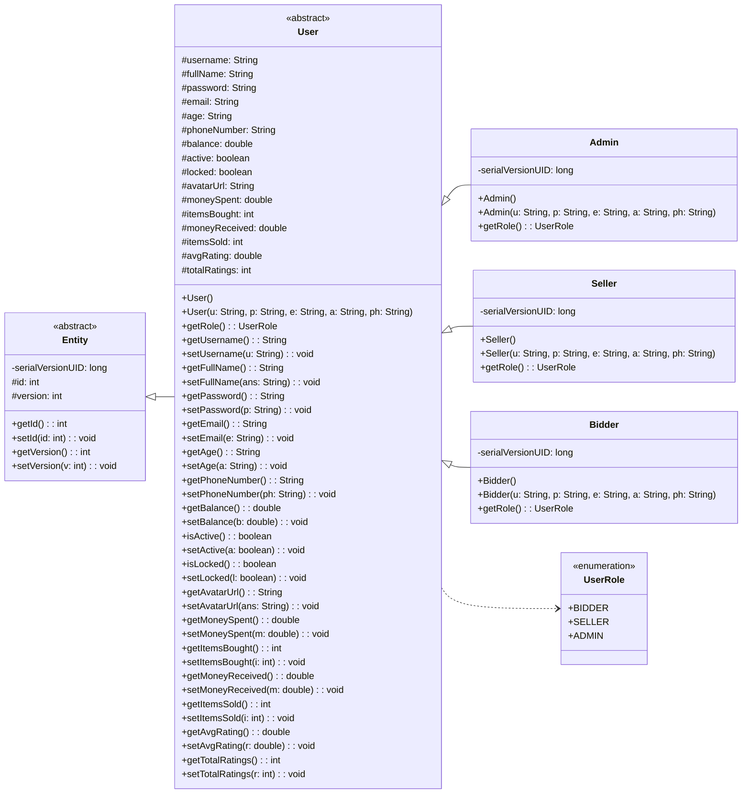

---

## 2) Shared Module - `com.auction.shared` - Auction and Protocol Types

```mermaid
classDiagram
direction LR

class Item {
  <<abstract>>
  -serialVersionUID: long
  #name: String
  #description: String
  #startingPrice: double
  #currentPrice: double
  #startTime: LocalDateTime
  #endTime: LocalDateTime
  #maxPrice: double
  #sellerId: int
  #winnerId: int
  #status: ItemStatus
  #imageUrl: String
  #sellerUsername: String
  #sellerAvatarUrl: String
  #category: String
  +Item()
  +Item(res: String, ans: String, res1: double, ans1: double, res2: int)
  +calculateTax(): double
  +getCategory(): String
  +setCategory(res: String): void
  +getName(): String
  +setName(res: String): void
  +getDescription(): String
  +setDescription(res: String): void
  +getStartingPrice(): double
  +setStartingPrice(res: double): void
  +getCurrentPrice(): double
  +setCurrentPrice(res: double): void
  +getStartTime(): LocalDateTime
  +setStartTime(res: LocalDateTime): void
  +getEndTime(): LocalDateTime
  +setEndTime(res: LocalDateTime): void
  +getMaxPrice(): double
  +setMaxPrice(res: double): void
  +getSellerId(): int
  +setSellerId(res: int): void
  +getWinnerId(): int
  +setWinnerId(res: int): void
  +getStatus(): ItemStatus
  +setStatus(res: ItemStatus): void
  +getImageUrl(): String
  +setImageUrl(res: String): void
  +getSellerUsername(): String
  +setSellerUsername(res: String): void
  +getSellerAvatarUrl(): String
  +setSellerAvatarUrl(res: String): void
}

class Art {
  +Art()
  +Art(res: String, ans: String, res1: double, ans1: double, res2: int)
  +getCategory(): String
  +calculateTax(): double
}

class Electronics {
  +Electronics()
  +Electronics(res: String, ans: String, res1: double, ans1: double, res2: int)
  +getCategory(): String
  +calculateTax(): double
}

class Vehicle {
  +Vehicle()
  +Vehicle(res: String, ans: String, res1: double, ans1: double, res2: int)
  +getCategory(): String
  +calculateTax(): double
}

class ItemStatus {
  <<enumeration>>
  +PENDING
  +OPEN
  +CLOSED
  +RUNNING
  +FINISHED
  +PAID
  +CANCELED
}

class ItemFactory {
  +createItem(res: String): Item
}

class BidTransaction {
  -serialVersionUID: long
  #itemId: int
  #userId: int
  #bidValue: double
  #timestamp: LocalDateTime
  #maxAutoBid: double
  #autoBid: boolean
  #autoBidIncrement: double
  +BidTransaction()
  +BidTransaction(res: int, ans: int, res1: double)
  +getItemId(): int
  +setItemId(res: int): void
  +getUserId(): int
  +setUserId(ans: int): void
  +getBidValue(): double
  +setBidValue(res: double): void
  +getTimestamp(): LocalDateTime
  +setTimestamp(ans: LocalDateTime): void
  +getMaxAutoBid(): double
  +setMaxAutoBid(res: double): void
  +isAutoBid(): boolean
  +setAutoBid(ans: boolean): void
  +getAutoBidIncrement(): double
  +setAutoBidIncrement(res: double): void
}

class Lot {
  -serialVersionUID: long
  -id: int
  -itemId: int
  -title: String
  -description: String
  -bidValue: double
  -startTime: LocalDateTime
  -endTime: LocalDateTime
  -imageUrl: String
  -sellerUsername: String
  -sellerAvatarUrl: String
  -winnerUsername: String
  +Lot()
  +getId(): int
  +setId(i: int): void
  +getItemId(): int
  +setItemId(i: int): void
  +getTitle(): String
  +setTitle(t: String): void
  +getDescription(): String
  +setDescription(d: String): void
  +getBidValue(): double
  +setBidValue(v: double): void
  +getStartTime(): LocalDateTime
  +setStartTime(t: LocalDateTime): void
  +getEndTime(): LocalDateTime
  +setEndTime(t: LocalDateTime): void
  +getImageUrl(): String
  +setImageUrl(u: String): void
  +getSellerUsername(): String
  +setSellerUsername(s: String): void
  +getSellerAvatarUrl(): String
  +setSellerAvatarUrl(s: String): void
  +getWinnerUsername(): String
  +setWinnerUsername(w: String): void
}

class Rating {
  -serialVersionUID: long
  -id: int
  -itemId: int
  -raterUserId: int
  -ratedUserId: int
  -stars: int
  -feedback: String
  -createdAt: LocalDateTime
  -raterUsername: String
  +Rating()
  +Rating(itemId: int, raterUserId: int, ratedUserId: int, stars: int, feedback: String)
  +getId(): int
  +setId(id: int): void
  +getItemId(): int
  +setItemId(res: int): void
  +getRaterUserId(): int
  +setRaterUserId(res: int): void
  +getRatedUserId(): int
  +setRatedUserId(res: int): void
  +getStars(): int
  +setStars(res: int): void
  +getFeedback(): String
  +setFeedback(res: String): void
  +getCreatedAt(): LocalDateTime
  +setCreatedAt(res: LocalDateTime): void
  +getRaterUsername(): String
  +setRaterUsername(res: String): void
}

class Request {
  -serialVersionUID: long
  +LOGIN: String
  +SIGNUP: String
  +BID: String
  +ADD: String
  +LIST: String
  +UPDATE_PROFILE: String
  +UPDATE_AVATAR: String
  +GET_ALL_USERS: String
  +LOCK_USER: String
  +UNLOCK_USER: String
  +ADD_LOT: String
  +GET_ONGOING_BIDS: String
  +GET_UPCOMING_BIDS: String
  +SUBMIT_RATING: String
  +GET_RATINGS: String
  +GET_PENDING_ITEMS: String
  +APPROVE_ITEM: String
  +REJECT_ITEM: String
  +GET_ITEM_BY_ID: String
  +PROMOTE_ADMIN: String
  +SEARCH_USERS: String
  +GET_USER_BY_ID: String
  +GET_ONGOING_LOTS: String
  #requestId: String
  #action: String
  #payload: Object
  #timestamp: LocalDateTime
  +Request(act: String, obj: Object)
  +getRequestId(): String
  +getAction(): String
  +getPayload(): Object
  +getTimestamp(): LocalDateTime
}

class Response {
  -serialVersionUID: long
  +OK: String
  +ERROR: String
  #requestId: String
  #status: String
  #message: String
  #payload: Object
  #timestamp: LocalDateTime
  +Response(rid: String, st: String, msg: String, obj: Object)
  +getRequestId(): String
  +getStatus(): String
  +getMessage(): String
  +getPayload(): Object
  +getTimestamp(): LocalDateTime
}

class TransactionLog {
  -serialVersionUID: long
  -id: int
  -userId: int
  -type: String
  -amount: double
  -itemId: int
  -createdAt: LocalDateTime
  +TransactionLog()
  +TransactionLog(u: int, t: String, a: double, i: int, c: LocalDateTime)
  +getId(): int
  +setId(res: int): void
  +getUserId(): int
  +setUserId(res: int): void
  +getType(): String
  +setType(res: String): void
  +getAmount(): double
  +setAmount(res: double): void
  +getItemId(): int
  +setItemId(res: int): void
  +getCreatedAt(): LocalDateTime
  +setCreatedAt(res: LocalDateTime): void
}

Entity <|-- Item
Entity <|-- BidTransaction
Item <|-- Art
Item <|-- Electronics
Item <|-- Vehicle
Item ..> ItemStatus
ItemFactory ..> Item
```

---

## 3) Server Module - `com.auction.server` + `com.auction.server.controller`

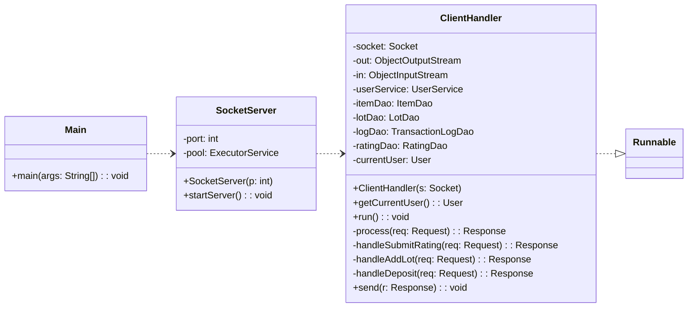

---

## 4) Server Module - `com.auction.server.service`

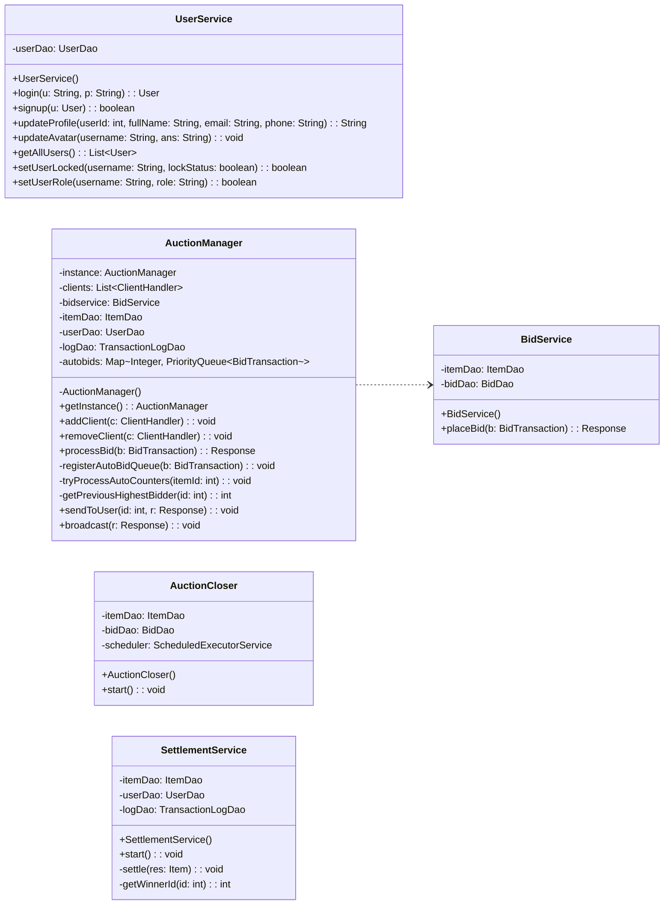

---

## 5) Server Module - `com.auction.server.dao`

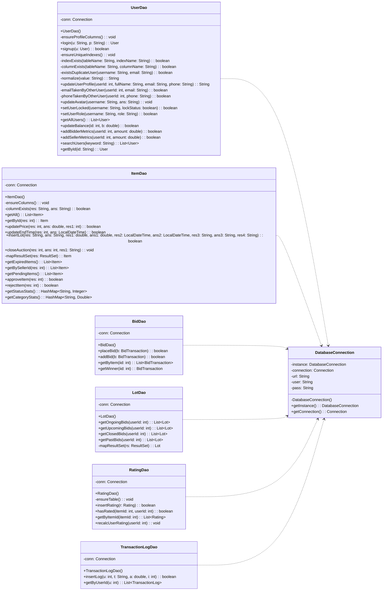

---

## 6) Client Module - `com.auction.client` Core

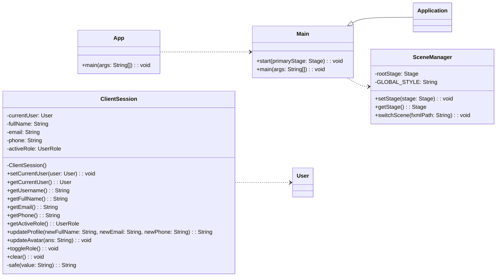

---

## 7) Client Module - `com.auction.client.app` + `com.auction.client.network`

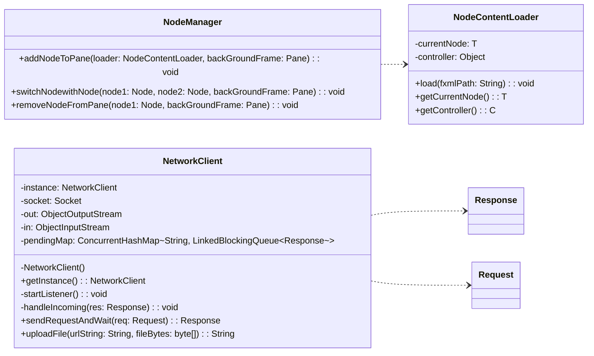

---

## 8) Client Module - `com.auction.client.controller`

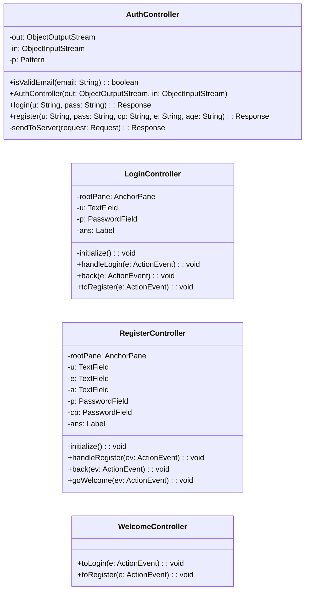

---

## 9) Client Module - `com.auction.client.ui.Main`

```mermaid
classDiagram
direction LR

class KhungController {
  -instance: KhungController
  -mainContentPane: Pane
  -currentContentNode: Node
  -searchKeyword: String
  -categoryFilter: String
  -filterMinPrice: double
  -filterMaxPrice: double
  +itemDetailController: ItemInformationController
  -an: Node
  -hn: Node
  -mn: Node
  -pn: Node
  -adn: Node
  -aln: Node
  -tc: TrangChuController
  -yc: YourItemController
  -hc: HistoryController
  -SearchContainer: HBox
  -ContentArea: StackPane
  -AuctionMenu: HBox
  -HistoryMenu: HBox
  -MyItemMenu: HBox
  -ProfileMenu: HBox
  -ManageUsersMenu: HBox
  -UserName: Label
  -Rank: Label
  -primaryactionbutton: Button
  -sidebaravatar: ImageView
  +initialize(): void
  +openAuction(e: MouseEvent): void
  +openHistory(e: MouseEvent): void
  +openMyItems(e: MouseEvent): void
  +openProfile(e: MouseEvent): void
  +openManageUsers(e: MouseEvent): void
  +handleRefresh(e: ActionEvent): void
  +handlePrimaryAction(e: ActionEvent): void
  +handleSignout(): void
  -switchPage(t: Node, m: HBox): void
  -setMenu(a: HBox): void
  +update(): void
  +getMainContentPane(): Pane
  +getCurrentNode(): Node
  +setMainContentNode(n: Node): void
  +refreshSidebarFromSession(): void
  +applySearchFilter(k: String, c: String, min: double, max: double): void
  +updateRealtimeUi(ans: Item): void
  +getSearchKeyword(): String
  +getCategoryFilter(): String
  +getMinPrice(): double
  +getMaxPrice(): double
  +returnFromAddLot(r: boolean): void
  +showUserProfile(user: User): void
  +returnToAuction(): void
}

class AdminDashboardController {
  -usertable: TableView~User~
  -colusername: TableColumn~User, String~
  -colemail: TableColumn~User, String~
  -colrole: TableColumn~User, String~
  -colstatus: TableColumn~User, String~
  -colrating: TableColumn~User, String~
  -btnban: Button
  -btnunban: Button
  -pendingtable: TableView~Item~
  -colitemname: TableColumn~Item, String~
  -colitemseller: TableColumn~Item, String~
  -colitemprice: TableColumn~Item, String~
  -colitemcategory: TableColumn~Item, String~
  -btnapprove: Button
  -btnreject: Button
  -ratingfilter: ComboBox~String~
  -statuschart: PieChart
  -categorychart: BarChart~String, Number~
  -userlist: ObservableList~User~
  -filtereduserlist: FilteredList~User~
  -pendinglist: ObservableList~Item~
  +initialize(): void
  -loadUsers(): void
  -loadPendingItems(): void
  -loadStats(): void
  -handleBan(event: ActionEvent): void
  -handleUnban(event: ActionEvent): void
  -handlePromoteAdmin(event: ActionEvent): void
  -handleApprove(event: ActionEvent): void
  -handleReject(event: ActionEvent): void
  -handleFilterChange(event: ActionEvent): void
  -handleRefreshPending(event: ActionEvent): void
  -showAlert(type: AlertType, title: String, content: String): void
}
```

---

## 10) Client Module - `TrangChu` + `ItemCard`

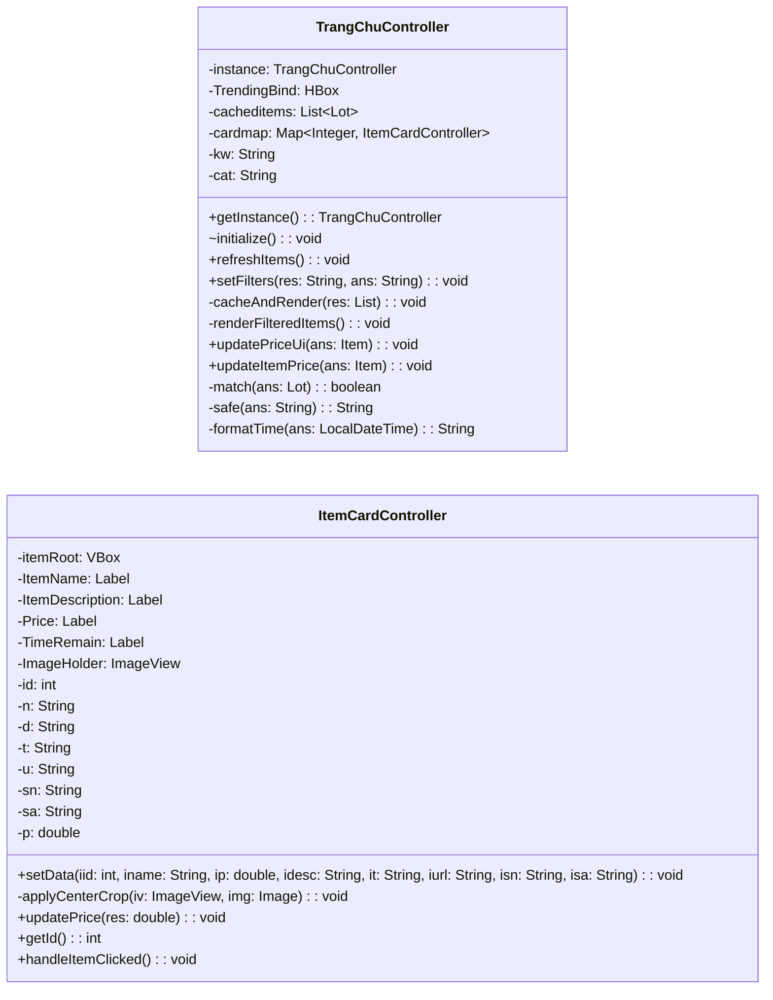

---

## 11) Client Module - `ItemInformation` + `BiddingForm` + `RatingForm`

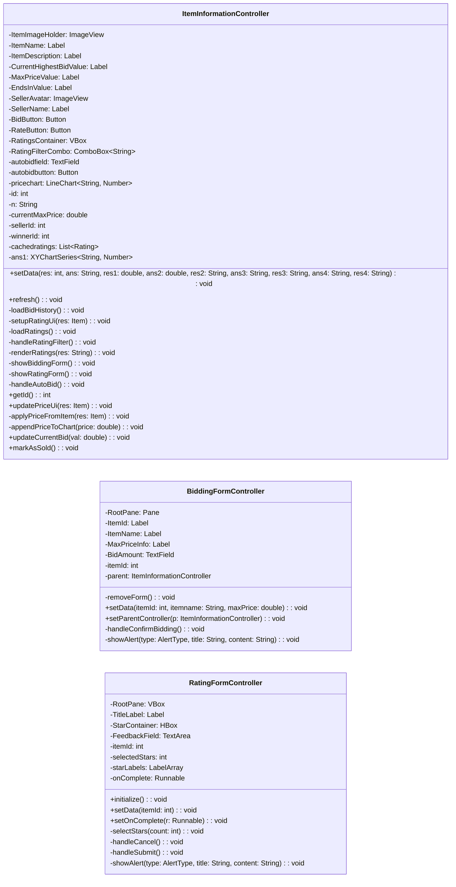

---

## 12) Client Module - `SearchBar`, `History`, `YourItem`, `UserProfile`, `Profile`, `TransactionHistory`, `util`

```mermaid
classDiagram
direction LR

class ThanhTimKiemController {
  -searchField: TextField
  -categoryFilter: ComboBox~String~
  -bellButton: Button
  -itemsToggle: ToggleButton
  -usersToggle: ToggleButton
  -searchModeGroup: ToggleGroup
  -minpricefield: TextField
  -maxpricefield: TextField
  -filterButton: Button
  -ans: NotificationPopup
  -res: Timer
  -ans1: boolean
  -res1: Popup
  -ans2: VBox
  +initialize(): void
  +onSearchModeChanged(): void
  -debounceUserSearch(ans3: String): void
  -searchUsers(ans3: String): void
  -showUserResults(ans3: List~User~): void
  -buildUserRow(ans3: User): HBox
  -hideUserResults(): void
  +applyFilter(): void
  +toggleNotifications(): void
}

class HistoryController {
  -ongoingcontainer: FlowPane
  -upcomingcontainer: FlowPane
  -closedcontainer: FlowPane
  -pastcontainer: FlowPane
  +initialize(): void
  +refreshHistory(): void
  -fetchOngoing(id: int): List~Lot~
  -fetchUpcoming(id: int): List~Lot~
  -fetchClosed(id: int): List~Lot~
  -fetchPast(id: int): List~Lot~
  -renderCards(p: FlowPane, list: List~Lot~, isOngoing: boolean): void
  -safe(s: String): String
  -formatTime(t: LocalDateTime): String
}

class YourItemController {
  -ItemContainer: FlowPane
  -ActiveItemsValue: Label
  -InventoryValue: Label
  ~initialize(): void
  +refreshItems(): void
  -render(ans: List~Item~): void
  +setFilters(k: String, c: String): void
  -match(ans: Item): boolean
}

class UserProfileController {
  -avatarImageView: ImageView
  -usernameLabel: Label
  -fullNameLabel: Label
  -emailLabel: Label
  -ratingStarsLabel: Label
  -ratingCountLabel: Label
  -reputationWarning: Label
  -itemsBoughtLabel: Label
  -itemsSoldLabel: Label
  -roleLabel: Label
  -itemsContainer: FlowPane
  -targetUser: User
  +setUser(user: User): void
  -populateData(): void
  -loadAvatar(): void
  -loadSellerItems(): void
  -buildItemCard(item: Item): VBox
  +handleBack(): void
}

class ProfileController {
  -avatarimageview: ImageView
  -usernameLabel: Label
  -fullNameLabel: Label
  -emailLabel: Label
  -phoneLabel: Label
  -roleLabel: Label
  -balanceLabel: Label
  -moneySpentLabel: Label
  -itemsBoughtLabel: Label
  -moneyReceivedLabel: Label
  -itemsSoldLabel: Label
  -ratingStarsLabel: Label
  -ratingCountLabel: Label
  -reputationWarning: Label
  -verifiedLabel: Label
  -fullNameInput: TextField
  -emailInput: TextField
  -phoneInput: TextField
  -DepositAmountField: TextField
  -editButton: Button
  -toggleRoleButton: Button
  -bidderMetricsRow: HBox
  -sellerMetricsRow: HBox
  -editing: boolean
  -instance: ProfileController
  +getInstance(): ProfileController
  +initialize(): void
  +updateBalanceDirectly(u: User): void
  +handleDeposit(): void
  +handleToggleRole(): void
  +refreshData(): void
  -setEditingMode(v: boolean): void
  +handleEditProfile(): void
  +handleLogout(): void
  +handleChangeAvatar(): void
  +handleRefresh(event: ActionEvent): void
  +handleShowHistory(): void
}

class TransactionHistoryController {
  -table: TableView~TransactionLog~
  -idcol: TableColumn~TransactionLog, String~
  -typecol: TableColumn~TransactionLog, String~
  -amountcol: TableColumn~TransactionLog, String~
  -itemcol: TableColumn~TransactionLog, String~
  -datecol: TableColumn~TransactionLog, String~
  +initialize(): void
  -loadData(): void
}

class AddNewLotController {
  -productImageView: ImageView
  -lblStatus: Label
  -txtName: TextField
  -txtPrice: TextField
  -txtMaxPrice: TextField
  -txtQuantity: TextArea
  -startDatePicker: DatePicker
  -startHourCombo: ComboBox~Integer~
  -startMinuteCombo: ComboBox~Integer~
  -startSecondCombo: ComboBox~Integer~
  -endDatePicker: DatePicker
  -endHourCombo: ComboBox~Integer~
  -endMinuteCombo: ComboBox~Integer~
  -endSecondCombo: ComboBox~Integer~
  -classifyComboBox: ComboBox~String~
  -lotimageurl: String
  -fmt: DateTimeFormatter
  -uploadUiGen: AtomicLong
  -live: AddNewLotController
  -CATEGORY_IN_BOX: String
  -DEFAULT_CATEGORY: String
  +resetWhenOpening(): void
  +initialize(): void
  +handleChoosePicture(e: ActionEvent): void
  +handleSubmit(e: ActionEvent): void
  +handleCancel(e: ActionEvent): void
  -clearForm(): void
  -normalizeDateTimeForServer(date: LocalDate, hour: Integer, minute: Integer, second: Integer): String
  -parseClientDateTime(value: String): LocalDateTime
}

class NotificationCenter {
  -ans: ObservableList~String~
  +addNotification(res: String): void
  +getNotifications(): ObservableList~String~
}

class NotificationPopup {
  -ans: Popup
  +NotificationPopup()
  +show(res: Window, x: double, y: double): void
}

NotificationPopup ..> NotificationCenter
ThanhTimKiemController ..> NotificationPopup
```

