# UML Project 

Tài liệu này được dựng lại từ toàn bộ source hiện tại của project.

- Có **đủ private/public/protected/package-private**.
- Có **đủ field + method** cho từng class.
- Có **đầy đủ mũi tên quan hệ** ở phần quan hệ tổng quan.
- Bố cục ưu tiên dễ nhìn: sơ đồ quan hệ tách riêng, chi tiết class tách block nhỏ.

## Ký hiệu
- `+`: public
- `-`: private
- `#`: protected
- `~`: package-private

---

## A) UML Quan Hệ (mũi tên đầy đủ, dễ nhìn)

### A1) Quan hệ module toàn cục

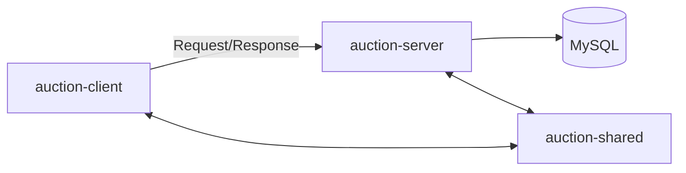

### A2) Shared - User hierarchy

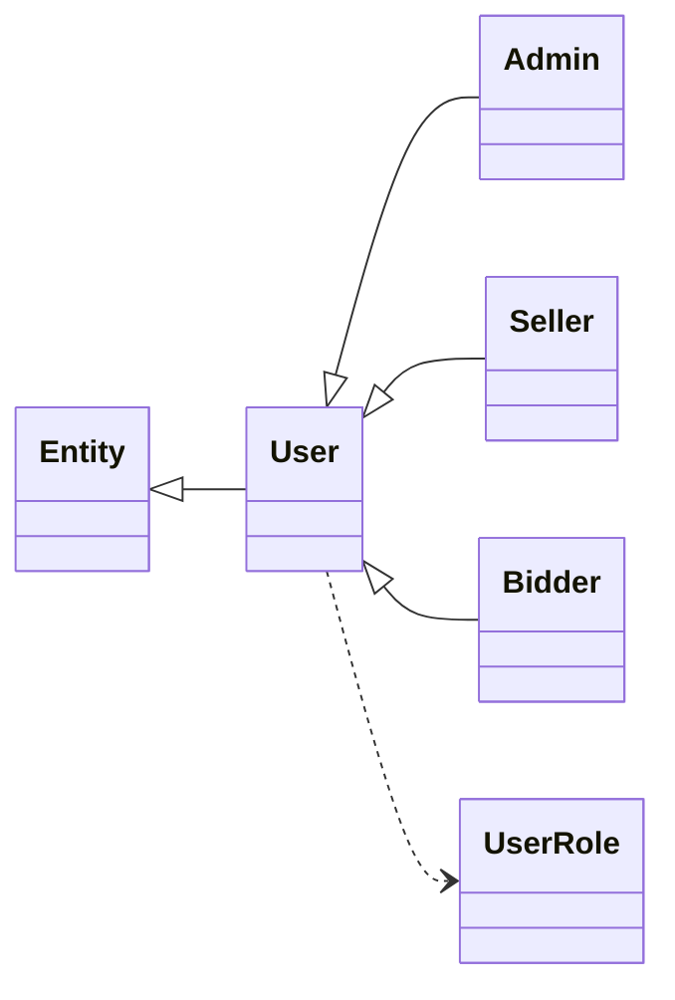

### A3) Shared - Item/Protocol hierarchy

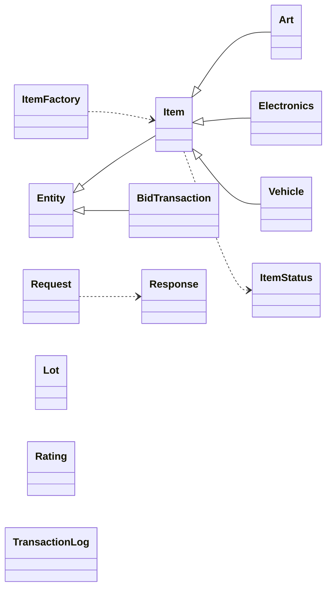

### A4) Server - Controller/Service/DAO relation

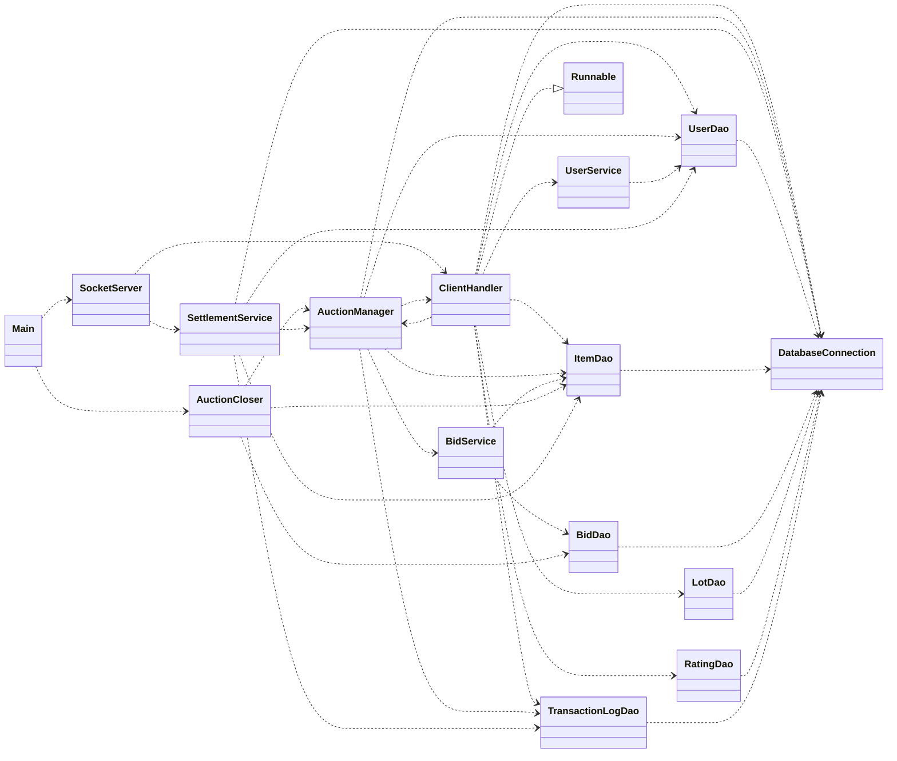

### A5) Client - Core/Auth/UI relation

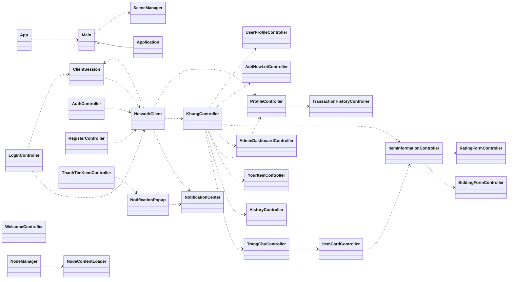

---

## B) UML Chi Tiết Từng Class (đầy đủ field + method)

## B1) Package `com.auction.shared`

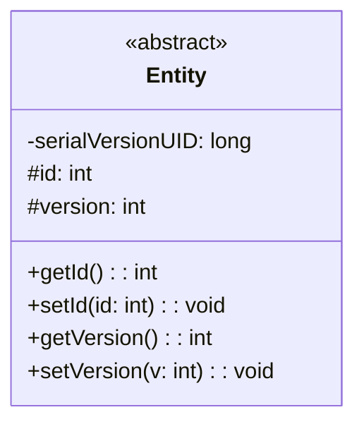

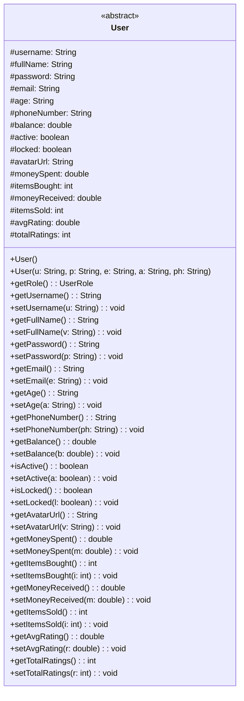

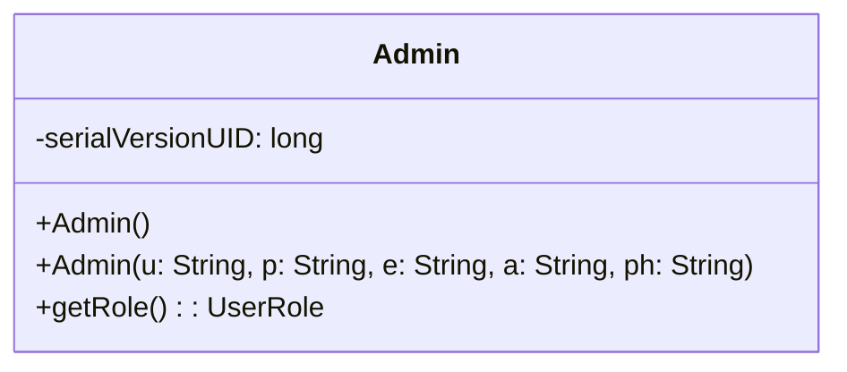

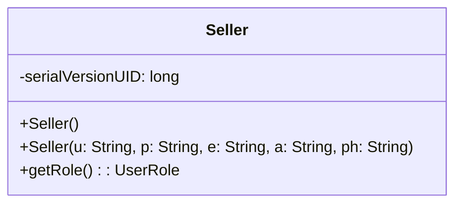

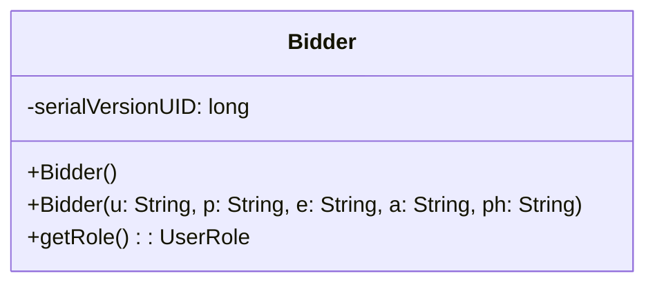

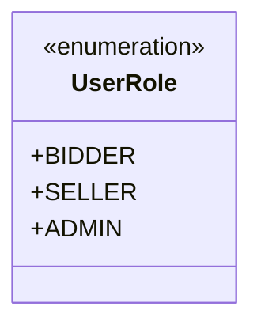

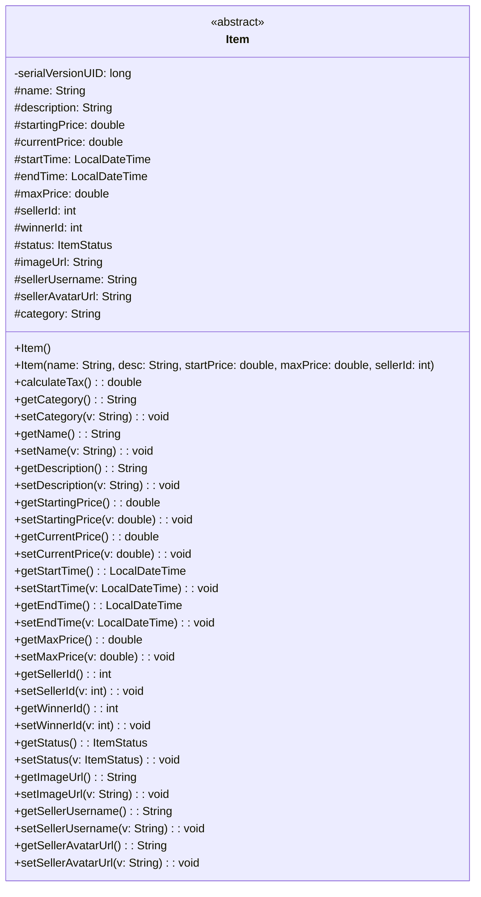

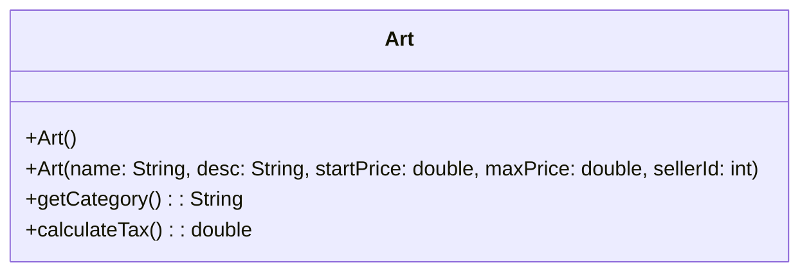

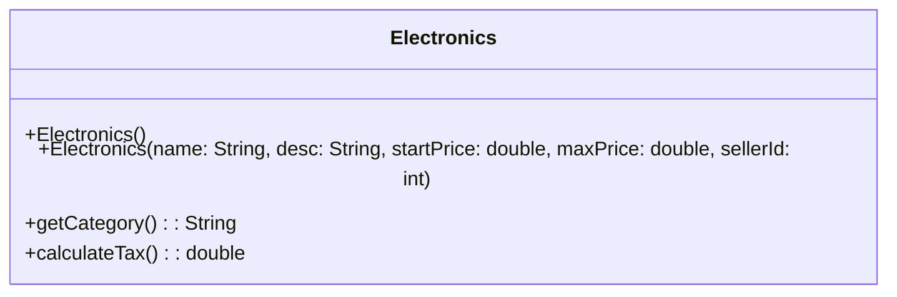

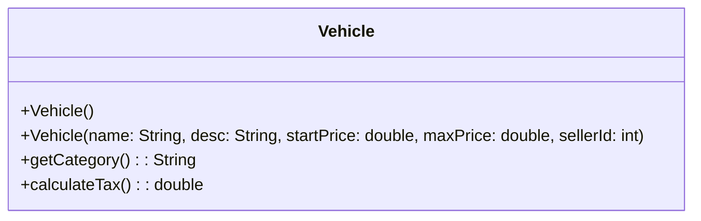

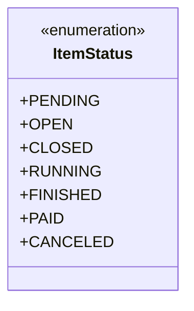

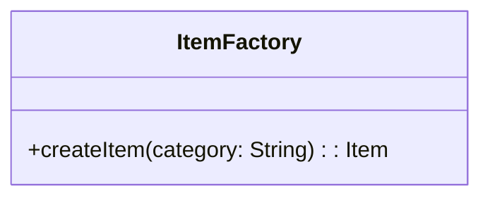

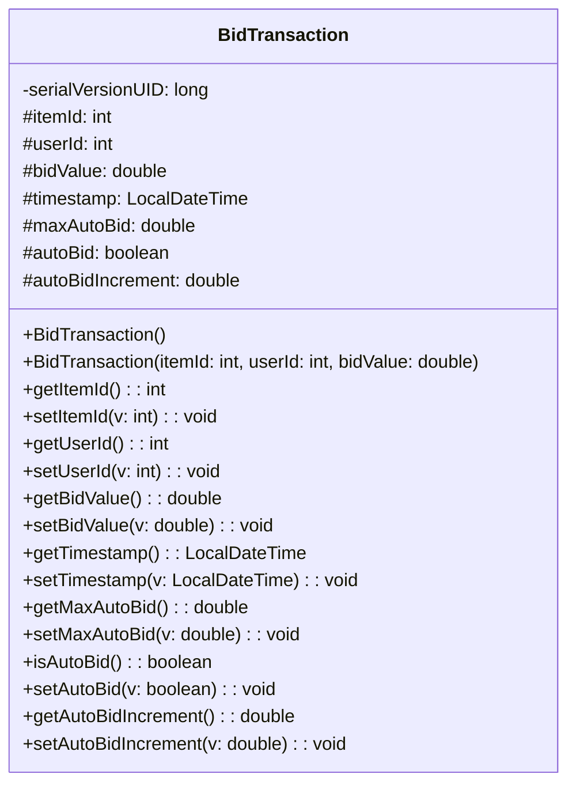

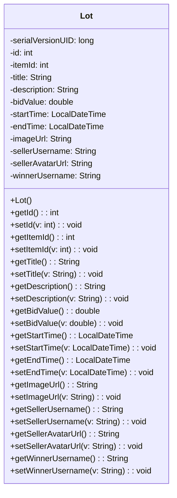

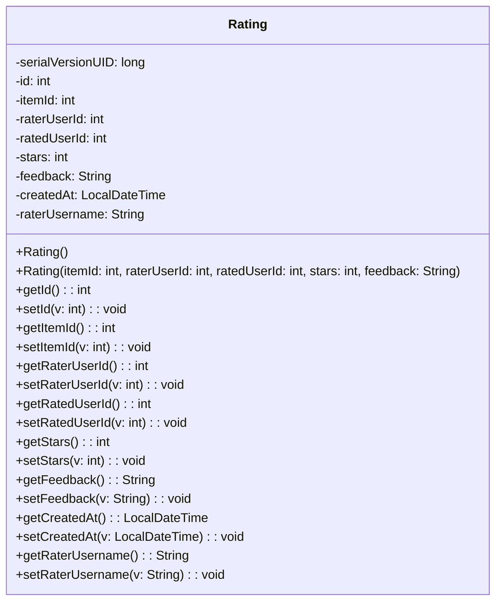

```mermaid
classDiagram
class Request {
  -serialVersionUID: long
  +LOGIN: String
  +SIGNUP: String
  +BID: String
  +ADD: String
  +LIST: String
  +UPDATE_PROFILE: String
  +UPDATE_AVATAR: String
  +GET_ALL_USERS: String
  +LOCK_USER: String
  +UNLOCK_USER: String
  +ADD_LOT: String
  +GET_ONGOING_BIDS: String
  +GET_UPCOMING_BIDS: String
  +SUBMIT_RATING: String
  +GET_RATINGS: String
  +GET_PENDING_ITEMS: String
  +APPROVE_ITEM: String
  +REJECT_ITEM: String
  +GET_ITEM_BY_ID: String
  +PROMOTE_ADMIN: String
  +SEARCH_USERS: String
  +GET_USER_BY_ID: String
  +GET_ONGOING_LOTS: String
  #requestId: String
  #action: String
  #payload: Object
  #timestamp: LocalDateTime
  +Request(act: String, obj: Object)
  +getRequestId(): String
  +getAction(): String
  +getPayload(): Object
  +getTimestamp(): LocalDateTime
}
```

```mermaid
classDiagram
class Response {
  -serialVersionUID: long
  +OK: String
  +ERROR: String
  #requestId: String
  #status: String
  #message: String
  #payload: Object
  #timestamp: LocalDateTime
  +Response(rid: String, st: String, msg: String, obj: Object)
  +getRequestId(): String
  +getStatus(): String
  +getMessage(): String
  +getPayload(): Object
  +getTimestamp(): LocalDateTime
}
```

```mermaid
classDiagram
class TransactionLog {
  -serialVersionUID: long
  -id: int
  -userId: int
  -type: String
  -amount: double
  -itemId: int
  -createdAt: LocalDateTime
  +TransactionLog()
  +TransactionLog(userId: int, type: String, amount: double, itemId: int, createdAt: LocalDateTime)
  +getId(): int
  +setId(v: int): void
  +getUserId(): int
  +setUserId(v: int): void
  +getType(): String
  +setType(v: String): void
  +getAmount(): double
  +setAmount(v: double): void
  +getItemId(): int
  +setItemId(v: int): void
  +getCreatedAt(): LocalDateTime
  +setCreatedAt(v: LocalDateTime): void
}
```

---

## B2) Package `com.auction.server`

```mermaid
classDiagram
class Main {
  +main(args: StringArray): void
}
```

## B3) Package `com.auction.server.controller`

```mermaid
classDiagram
class SocketServer {
  -port: int
  -pool: ExecutorService
  +SocketServer(p: int)
  +startServer(): void
}
```

```mermaid
classDiagram
class ClientHandler {
  -socket: Socket
  -out: ObjectOutputStream
  -in: ObjectInputStream
  -userService: UserService
  -itemDao: ItemDao
  -lotDao: LotDao
  -logDao: TransactionLogDao
  -ratingDao: RatingDao
  -currentUser: User
  +ClientHandler(s: Socket)
  +getCurrentUser(): User
  +run(): void
  -process(req: Request): Response
  -handleSubmitRating(req: Request): Response
  -handleAddLot(req: Request): Response
  -handleDeposit(req: Request): Response
  +send(r: Response): void
}
```

## B4) Package `com.auction.server.service`

```mermaid
classDiagram
class UserService {
  -userDao: UserDao
  +UserService()
  +login(u: String, p: String): User
  +signup(u: User): boolean
  +updateProfile(userId: int, fullName: String, email: String, phone: String): String
  +updateAvatar(username: String, avatarUrl: String): void
  +getAllUsers(): List
  +setUserLocked(username: String, lockStatus: boolean): boolean
  +setUserRole(username: String, role: String): boolean
}
```

```mermaid
classDiagram
class BidService {
  -itemDao: ItemDao
  -bidDao: BidDao
  +BidService()
  +placeBid(b: BidTransaction): Response
}
```

```mermaid
classDiagram
class AuctionManager {
  -instance: AuctionManager
  -clients: List
  -bidservice: BidService
  -itemDao: ItemDao
  -userDao: UserDao
  -logDao: TransactionLogDao
  -autobids: Map
  -AuctionManager()
  +getInstance(): AuctionManager
  +addClient(c: ClientHandler): void
  +removeClient(c: ClientHandler): void
  +processBid(b: BidTransaction): Response
  -registerAutoBidQueue(b: BidTransaction): void
  -tryProcessAutoCounters(itemId: int): void
  -getPreviousHighestBidder(id: int): int
  +sendToUser(id: int, r: Response): void
  +broadcast(r: Response): void
}
```

```mermaid
classDiagram
class AuctionCloser {
  -itemDao: ItemDao
  -bidDao: BidDao
  -scheduler: ScheduledExecutorService
  +AuctionCloser()
  +start(): void
}
```

```mermaid
classDiagram
class SettlementService {
  -itemDao: ItemDao
  -userDao: UserDao
  -logDao: TransactionLogDao
  +SettlementService()
  +start(): void
  -settle(item: Item): void
  -getWinnerId(itemId: int): int
}
```

## B5) Package `com.auction.server.dao`

```mermaid
classDiagram
class DatabaseConnection {
  -instance: DatabaseConnection
  -connection: Connection
  -url: String
  -user: String
  -pass: String
  -DatabaseConnection()
  +getInstance(): DatabaseConnection
  +getConnection(): Connection
}
```

```mermaid
classDiagram
class UserDao {
  -conn: Connection
  +UserDao()
  -ensureProfileColumns(): void
  +login(u: String, p: String): User
  +signup(u: User): boolean
  -ensureUniqueIndexes(): void
  -indexExists(tableName: String, indexName: String): boolean
  -columnExists(tableName: String, columnName: String): boolean
  -existsDuplicateUser(username: String, email: String): boolean
  -normalize(value: String): String
  +updateUserProfile(userId: int, fullName: String, email: String, phone: String): String
  -emailTakenByOtherUser(userId: int, email: String): boolean
  -phoneTakenByOtherUser(userId: int, phone: String): boolean
  +updateAvatar(username: String, avatarUrl: String): void
  +setUserLocked(username: String, lockStatus: boolean): boolean
  +setUserRole(username: String, role: String): boolean
  +getAllUsers(): List
  +updateBalance(id: int, b: double): boolean
  +addBidderMetrics(userId: int, amount: double): boolean
  +addSellerMetrics(userId: int, amount: double): boolean
  +searchUsers(keyword: String): List
  +getById(id: String): User
}
```

```mermaid
classDiagram
class ItemDao {
  -conn: Connection
  +ItemDao()
  -ensureColumns(): void
  -columnExists(tableName: String, columnName: String): boolean
  +getAll(): List
  +getById(id: int): Item
  +updatePrice(itemId: int, bidValue: double, version: int): boolean
  +updateEndTime(itemId: int, endTime: LocalDateTime): boolean
  +insertLot(name: String, desc: String, startingPrice: double, maxPrice: double, startTime: LocalDateTime, endTime: LocalDateTime, sellerUsername: String, imageUrl: String, category: String): boolean
  +closeAuction(itemId: int, winnerId: int, status: String): void
  -mapResultSet(rs: ResultSet): Item
  +getExpiredItems(): List
  +getBySellerId(sellerId: int): List
  +getPendingItems(): List
  +approveItem(itemId: int): boolean
  +rejectItem(itemId: int): boolean
  +getStatusStats(): HashMap
  +getCategoryStats(): HashMap
}
```

```mermaid
classDiagram
class BidDao {
  -conn: Connection
  +BidDao()
  +placeBid(b: BidTransaction): boolean
  +addBid(b: BidTransaction): boolean
  +getByItem(itemId: int): List
  +getWinner(itemId: int): BidTransaction
}
```

```mermaid
classDiagram
class LotDao {
  -conn: Connection
  +LotDao()
  +getOngoingBids(userId: int): List
  +getUpcomingBids(userId: int): List
  +getClosedBids(userId: int): List
  +getPastBids(userId: int): List
  -mapResultSet(rs: ResultSet): Lot
}
```

```mermaid
classDiagram
class RatingDao {
  -conn: Connection
  +RatingDao()
  -ensureTable(): void
  +insertRating(r: Rating): boolean
  +hasRated(itemId: int, userId: int): boolean
  +getByItemId(itemId: int): List
  +recalcUserRating(userId: int): void
}
```

```mermaid
classDiagram
class TransactionLogDao {
  -conn: Connection
  +TransactionLogDao()
  +insertLog(userId: int, type: String, amount: double, itemId: int): boolean
  +getByUserId(userId: int): List
}
```

---

## B6) Package `com.auction.client` + `app` + `network` + `controller`

```mermaid
classDiagram
class App { +main(args: StringArray): void }
```

```mermaid
classDiagram
class Main {
  +start(primaryStage: Stage): void
  +main(args: StringArray): void
}
```

```mermaid
classDiagram
class SceneManager {
  -rootStage: Stage
  -GLOBAL_STYLE: String
  +setStage(stage: Stage): void
  +getStage(): Stage
  +switchScene(fxmlPath: String): void
}
```

```mermaid
classDiagram
class ClientSession {
  -currentUser: User
  -fullName: String
  -email: String
  -phone: String
  -activeRole: UserRole
  -ClientSession()
  +setCurrentUser(user: User): void
  +getCurrentUser(): User
  +getUsername(): String
  +getFullName(): String
  +getEmail(): String
  +getPhone(): String
  +getActiveRole(): UserRole
  +updateProfile(newFullName: String, newEmail: String, newPhone: String): String
  +updateAvatar(ans: String): void
  +toggleRole(): void
  +clear(): void
  -safe(value: String): String
}
```

```mermaid
classDiagram
class NodeManager {
  +addNodeToPane(loader: NodeContentLoader, backGroundFrame: Pane): void
  +switchNodewithNode(node1: Node, node2: Node, backGroundFrame: Pane): void
  +removeNodeFromPane(node1: Node, backGroundFrame: Pane): void
}
```

```mermaid
classDiagram
class NodeContentLoader {
  -currentNode: T
  -controller: Object
  +load(fxmlPath: String): void
  +getCurrentNode(): T
  +getController(): C
}
```

```mermaid
classDiagram
class NetworkClient {
  -instance: NetworkClient
  -socket: Socket
  -out: ObjectOutputStream
  -in: ObjectInputStream
  -pendingMap: ConcurrentHashMap
  -NetworkClient()
  +getInstance(): NetworkClient
  -startListener(): void
  -handleIncoming(res: Response): void
  +sendRequestAndWait(req: Request): Response
  +uploadFile(urlString: String, fileBytes: ByteArray): String
}
```

```mermaid
classDiagram
class AuthController {
  -out: ObjectOutputStream
  -in: ObjectInputStream
  -p: Pattern
  +isValidEmail(email: String): boolean
  +AuthController(out: ObjectOutputStream, in: ObjectInputStream)
  +login(u: String, pass: String): Response
  +register(u: String, pass: String, cp: String, e: String, age: String): Response
  -sendToServer(request: Request): Response
}
```

```mermaid
classDiagram
class LoginController {
  -rootPane: AnchorPane
  -u: TextField
  -p: PasswordField
  -ans: Label
  -initialize(): void
  +handleLogin(e: ActionEvent): void
  +back(e: ActionEvent): void
  +toRegister(e: ActionEvent): void
}
```

```mermaid
classDiagram
class RegisterController {
  -rootPane: AnchorPane
  -u: TextField
  -e: TextField
  -a: TextField
  -p: PasswordField
  -cp: PasswordField
  -ans: Label
  -initialize(): void
  +handleRegister(ev: ActionEvent): void
  +back(ev: ActionEvent): void
  +goWelcome(ev: ActionEvent): void
}
```

```mermaid
classDiagram
class WelcomeController {
  +toLogin(e: ActionEvent): void
  +toRegister(e: ActionEvent): void
}
```

---

## B7) Package `com.auction.client.ui.*` + `com.auction.client.util`

```mermaid
classDiagram
class KhungController {
  -instance: KhungController
  -mainContentPane: Pane
  -currentContentNode: Node
  -searchKeyword: String
  -categoryFilter: String
  -filterMinPrice: double
  -filterMaxPrice: double
  +itemDetailController: ItemInformationController
  -an: Node
  -hn: Node
  -mn: Node
  -pn: Node
  -adn: Node
  -aln: Node
  -tc: TrangChuController
  -yc: YourItemController
  -hc: HistoryController
  -SearchContainer: HBox
  -ContentArea: StackPane
  -AuctionMenu: HBox
  -HistoryMenu: HBox
  -MyItemMenu: HBox
  -ProfileMenu: HBox
  -ManageUsersMenu: HBox
  -UserName: Label
  -Rank: Label
  -primaryactionbutton: Button
  -sidebaravatar: ImageView
  +initialize(): void
  +openAuction(e: MouseEvent): void
  +openHistory(e: MouseEvent): void
  +openMyItems(e: MouseEvent): void
  +openProfile(e: MouseEvent): void
  +openManageUsers(e: MouseEvent): void
  +handleRefresh(e: ActionEvent): void
  +handlePrimaryAction(e: ActionEvent): void
  +handleSignout(): void
  -switchPage(t: Node, m: HBox): void
  -setMenu(a: HBox): void
  +update(): void
  +getMainContentPane(): Pane
  +getCurrentNode(): Node
  +setMainContentNode(n: Node): void
  +refreshSidebarFromSession(): void
  +applySearchFilter(k: String, c: String, min: double, max: double): void
  +updateRealtimeUi(ans: Item): void
  +getSearchKeyword(): String
  +getCategoryFilter(): String
  +getMinPrice(): double
  +getMaxPrice(): double
  +returnFromAddLot(r: boolean): void
  +showUserProfile(user: User): void
  +returnToAuction(): void
}
```

```mermaid
classDiagram
class AdminDashboardController {
  -usertable: TableView
  -colusername: TableColumn
  -colemail: TableColumn
  -colrole: TableColumn
  -colstatus: TableColumn
  -colrating: TableColumn
  -btnban: Button
  -btnunban: Button
  -pendingtable: TableView
  -colitemname: TableColumn
  -colitemseller: TableColumn
  -colitemprice: TableColumn
  -colitemcategory: TableColumn
  -btnapprove: Button
  -btnreject: Button
  -ratingfilter: ComboBox
  -statuschart: PieChart
  -categorychart: BarChart
  -userlist: ObservableList
  -filtereduserlist: FilteredList
  -pendinglist: ObservableList
  +initialize(): void
  -loadUsers(): void
  -loadPendingItems(): void
  -loadStats(): void
  -handleBan(event: ActionEvent): void
  -handleUnban(event: ActionEvent): void
  -handlePromoteAdmin(event: ActionEvent): void
  -handleApprove(event: ActionEvent): void
  -handleReject(event: ActionEvent): void
  -handleFilterChange(event: ActionEvent): void
  -handleRefreshPending(event: ActionEvent): void
  -showAlert(type: AlertType, title: String, content: String): void
}
```

```mermaid
classDiagram
class TrangChuController {
  -instance: TrangChuController
  -TrendingBind: HBox
  -cacheditems: List
  -cardmap: Map
  -kw: String
  -cat: String
  +getInstance(): TrangChuController
  ~initialize(): void
  +refreshItems(): void
  +setFilters(res: String, ans: String): void
  -cacheAndRender(res: List): void
  -renderFilteredItems(): void
  +updatePriceUi(ans: Item): void
  +updateItemPrice(ans: Item): void
  -match(ans: Lot): boolean
  -safe(ans: String): String
  -formatTime(ans: LocalDateTime): String
}
```

```mermaid
classDiagram
class ItemCardController {
  -itemRoot: VBox
  -ItemName: Label
  -ItemDescription: Label
  -Price: Label
  -TimeRemain: Label
  -ImageHolder: ImageView
  -id: int
  -n: String
  -d: String
  -t: String
  -u: String
  -sn: String
  -sa: String
  -p: double
  +setData(iid: int, iname: String, ip: double, idesc: String, it: String, iurl: String, isn: String, isa: String): void
  -applyCenterCrop(iv: ImageView, img: Image): void
  +updatePrice(res: double): void
  +getId(): int
  +handleItemClicked(): void
}
```

```mermaid
classDiagram
class ItemInformationController {
  -ItemImageHolder: ImageView
  -ItemName: Label
  -ItemDescription: Label
  -CurrentHighestBidValue: Label
  -MaxPriceValue: Label
  -EndsInValue: Label
  -SellerAvatar: ImageView
  -SellerName: Label
  -BidButton: Button
  -RateButton: Button
  -RatingsContainer: VBox
  -RatingFilterCombo: ComboBox
  -autobidfield: TextField
  -autobidbutton: Button
  -pricechart: LineChart
  -id: int
  -n: String
  -currentMaxPrice: double
  -sellerId: int
  -winnerId: int
  -cachedratings: List
  -ans1: XYChartSeries
  +setData(res: int, ans: String, res1: double, ans2: double, res2: String, ans3: String, res3: String, ans4: String, res4: String): void
  +refresh(): void
  -loadBidHistory(): void
  -setupRatingUi(res: Item): void
  -loadRatings(): void
  -handleRatingFilter(): void
  -renderRatings(res: String): void
  -showBiddingForm(): void
  -showRatingForm(): void
  -handleAutoBid(): void
  +getId(): int
  +updatePriceUi(res: Item): void
  -applyPriceFromItem(res: Item): void
  -appendPriceToChart(price: double): void
  +updateCurrentBid(val: double): void
  +markAsSold(): void
}
```

```mermaid
classDiagram
class BiddingFormController {
  -RootPane: Pane
  -ItemId: Label
  -ItemName: Label
  -MaxPriceInfo: Label
  -BidAmount: TextField
  -itemId: int
  -parent: ItemInformationController
  -removeForm(): void
  +setData(itemId: int, itemname: String, maxPrice: double): void
  +setParentController(p: ItemInformationController): void
  -handleConfirmBidding(): void
  -showAlert(type: AlertType, title: String, content: String): void
}
```

```mermaid
classDiagram
class RatingFormController {
  -RootPane: VBox
  -TitleLabel: Label
  -StarContainer: HBox
  -FeedbackField: TextArea
  -itemId: int
  -selectedStars: int
  -starLabels: LabelArray
  -onComplete: Runnable
  +initialize(): void
  +setData(itemId: int): void
  +setOnComplete(r: Runnable): void
  -selectStars(count: int): void
  -handleCancel(): void
  -handleSubmit(): void
  -showAlert(type: AlertType, title: String, content: String): void
}
```

```mermaid
classDiagram
class ProfileController {
  -avatarimageview: ImageView
  -usernameLabel: Label
  -fullNameLabel: Label
  -emailLabel: Label
  -phoneLabel: Label
  -roleLabel: Label
  -balanceLabel: Label
  -moneySpentLabel: Label
  -itemsBoughtLabel: Label
  -moneyReceivedLabel: Label
  -itemsSoldLabel: Label
  -ratingStarsLabel: Label
  -ratingCountLabel: Label
  -reputationWarning: Label
  -verifiedLabel: Label
  -fullNameInput: TextField
  -emailInput: TextField
  -phoneInput: TextField
  -DepositAmountField: TextField
  -editButton: Button
  -toggleRoleButton: Button
  -bidderMetricsRow: HBox
  -sellerMetricsRow: HBox
  -editing: boolean
  -instance: ProfileController
  +getInstance(): ProfileController
  +initialize(): void
  +updateBalanceDirectly(u: User): void
  +handleDeposit(): void
  +handleToggleRole(): void
  +refreshData(): void
  -setEditingMode(v: boolean): void
  +handleEditProfile(): void
  +handleLogout(): void
  +handleChangeAvatar(): void
  +handleRefresh(event: ActionEvent): void
  +handleShowHistory(): void
}
```

```mermaid
classDiagram
class UserProfileController {
  -avatarImageView: ImageView
  -usernameLabel: Label
  -fullNameLabel: Label
  -emailLabel: Label
  -ratingStarsLabel: Label
  -ratingCountLabel: Label
  -reputationWarning: Label
  -itemsBoughtLabel: Label
  -itemsSoldLabel: Label
  -roleLabel: Label
  -itemsContainer: FlowPane
  -targetUser: User
  +setUser(user: User): void
  -populateData(): void
  -loadAvatar(): void
  -loadSellerItems(): void
  -buildItemCard(item: Item): VBox
  +handleBack(): void
}
```

```mermaid
classDiagram
class HistoryController {
  -ongoingcontainer: FlowPane
  -upcomingcontainer: FlowPane
  -closedcontainer: FlowPane
  -pastcontainer: FlowPane
  +initialize(): void
  +refreshHistory(): void
  -fetchOngoing(id: int): List
  -fetchUpcoming(id: int): List
  -fetchClosed(id: int): List
  -fetchPast(id: int): List
  -renderCards(p: FlowPane, list: List, isOngoing: boolean): void
  -safe(s: String): String
  -formatTime(t: LocalDateTime): String
}
```

```mermaid
classDiagram
class YourItemController {
  -ItemContainer: FlowPane
  -ActiveItemsValue: Label
  -InventoryValue: Label
  ~initialize(): void
  +refreshItems(): void
  -render(ans: List): void
  +setFilters(k: String, c: String): void
  -match(ans: Item): boolean
}
```

```mermaid
classDiagram
class AddNewLotController {
  -productImageView: ImageView
  -lblStatus: Label
  -txtName: TextField
  -txtPrice: TextField
  -txtMaxPrice: TextField
  -txtQuantity: TextArea
  -startDatePicker: DatePicker
  -startHourCombo: ComboBox
  -startMinuteCombo: ComboBox
  -startSecondCombo: ComboBox
  -endDatePicker: DatePicker
  -endHourCombo: ComboBox
  -endMinuteCombo: ComboBox
  -endSecondCombo: ComboBox
  -classifyComboBox: ComboBox
  -lotimageurl: String
  -fmt: DateTimeFormatter
  -uploadUiGen: AtomicLong
  -live: AddNewLotController
  -CATEGORY_IN_BOX: String
  -DEFAULT_CATEGORY: String
  +resetWhenOpening(): void
  +initialize(): void
  +handleChoosePicture(e: ActionEvent): void
  +handleSubmit(e: ActionEvent): void
  +handleCancel(e: ActionEvent): void
  -clearForm(): void
  -normalizeDateTimeForServer(date: LocalDate, hour: Integer, minute: Integer, second: Integer): String
  -parseClientDateTime(value: String): LocalDateTime
}
```

```mermaid
classDiagram
class ThanhTimKiemController {
  -searchField: TextField
  -categoryFilter: ComboBox
  -bellButton: Button
  -itemsToggle: ToggleButton
  -usersToggle: ToggleButton
  -searchModeGroup: ToggleGroup
  -minpricefield: TextField
  -maxpricefield: TextField
  -filterButton: Button
  -ans: NotificationPopup
  -res: Timer
  -ans1: boolean
  -res1: Popup
  -ans2: VBox
  +initialize(): void
  +onSearchModeChanged(): void
  -debounceUserSearch(ans3: String): void
  -searchUsers(ans3: String): void
  -showUserResults(ans3: List): void
  -buildUserRow(ans3: User): HBox
  -hideUserResults(): void
  +applyFilter(): void
  +toggleNotifications(): void
}
```

```mermaid
classDiagram
class TransactionHistoryController {
  -table: TableView
  -idcol: TableColumn
  -typecol: TableColumn
  -amountcol: TableColumn
  -itemcol: TableColumn
  -datecol: TableColumn
  +initialize(): void
  -loadData(): void
}
```

```mermaid
classDiagram
class NotificationCenter {
  -ans: ObservableList
  +addNotification(res: String): void
  +getNotifications(): ObservableList
}
```

```mermaid
classDiagram
class NotificationPopup {
  -ans: Popup
  +NotificationPopup()
  +show(res: Window, x: double, y: double): void
}

```
# ĐỌC BẢN TÓM TẮT ĐI NẾU KHÔNG MUỐN ĐAU MẮT ☠️
