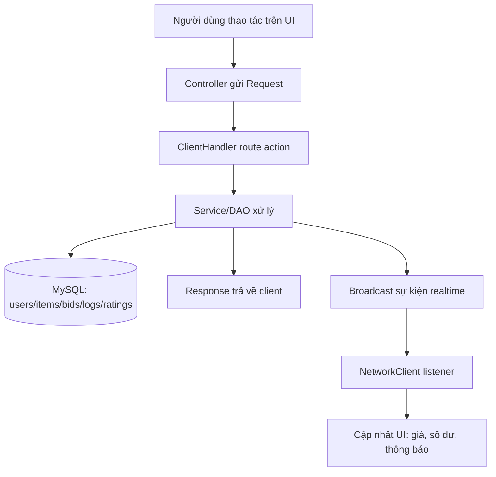

# Auction System JavaFX - Ma trận tương tác người dùng

## A) Thao tác user -> request -> DB -> realtime

| Thao tác người dùng | Màn hình/Controller | Request gửi | Server xử lý chính | DB đọc | DB ghi | Realtime/Event |
|---|---|---|---|---|---|---|
| Đăng nhập | `login.fxml` / `LoginController` | `LOGIN` | `UserService.login -> UserDao.login` | `users` | - | - |
| Đăng ký tài khoản | `register.fxml` / `RegisterController` | `SIGNUP` | `UserService.signup -> UserDao.signup` | `users` (check trùng) | `users` (insert) | - |
| Xem danh sách lot đang mở | `TrangChuController` | `GET_ONGOING_BIDS` (hoặc `LIST`) | `LotDao.getOngoingBids` / `ItemDao.getAll` + filter | `items`, `users` | - | - |
| Mở chi tiết item | `ItemInformationController` | `GET_ITEM_BY_ID` | `ItemDao.getById` | `items`, `users` | - | - |
| Xem lịch sử giá item | `ItemInformationController` | `get_bid_history` | query trực tiếp trong `ClientHandler` | `bid_transactions` | - | - |
| Đặt bid thường | `BiddingFormController` | `BID` | `AuctionManager.processBid -> BidService.placeBid` | `items`, `users`, `bid_transactions` | `users.balance`, `bid_transactions`, `items.currentprice/endtime/version`, `transaction_logs` | `BALANCE_UPDATE`, `NEW_BID_UPDATE`, `OUTBID_NOTIFY` |
| Đặt auto-bid | `ItemInformationController` | `BID` (flag auto) | `AuctionManager` (queue auto-bid + counter-bid) | như bid thường | như bid thường | như bid thường |
| Buy-now (chạm max price) | qua `BID` | `BID` | nhánh buy-now trong `AuctionManager` | `items`, `users` | `users.balance`, metrics user, `items.status/winnerid/currentprice`, `transaction_logs` | broadcast kết quả + `BALANCE_UPDATE` |
| Seller đăng lot mới | `AddNewLotController` | `ADD_LOT` | `handleAddLot -> ItemDao.insertLot` | `users` (tìm sellerid) | `items` (status `PENDING`) | - |
| Seller xem item của mình | `YourItemController` | `get_my_items` | `ItemDao.getBySellerId` | `items` | - | - |
| User nạp tiền | `ProfileController` | `deposit` | `handleDeposit` | `users` | `users.balance`, `transaction_logs` (`DEPOSIT`) | response trả user mới |
| User refresh profile/số dư | `ProfileController` | `refresh_user` | `UserDao.getById` | `users` | - | - |
| User cập nhật hồ sơ | `ProfileController`/`ClientSession` | `UPDATE_PROFILE` | `UserService.updateProfile` | `users` | `users(fullname,email,phonenumber)` | - |
| User cập nhật avatar | `ProfileController`/`ClientSession` | `UPDATE_AVATAR` | `UserService.updateAvatar` | `users` | `users.avatar_url` | - |
| Xem lịch sử giao dịch | `TransactionHistoryController` | `get_transactions` | `TransactionLogDao.getByUserId` | `transaction_logs` | - | - |
| Xem rating item | `ItemInformationController` | `GET_RATINGS` | `RatingDao.getByItemId` | `ratings`, `users` | - | - |
| Gửi rating sau khi đóng phiên | `RatingFormController` | `SUBMIT_RATING` | `handleSubmitRating -> RatingDao` | `items`, `ratings` | `ratings`, `users.avgrating/totalratings` | - |
| Tìm user | `ThanhTimKiemController` | `SEARCH_USERS` | `UserDao.searchUsers` | `users` | - | - |
| Mở profile user khác | `UserProfileController` | `GET_USER_BY_ID` | `UserDao.getById` | `users` | - | - |
| Lịch sử (ongoing/upcoming/closed/past) | `HistoryController` | `GET_ONGOING_BIDS`, `GET_UPCOMING_BIDS`, `getclosedbids`, `getpastbids` | `LotDao.*` | `items`, `users` | - | - |
| Admin xem pending items | `AdminDashboardController` | `GET_PENDING_ITEMS` | `ItemDao.getPendingItems` | `items`, `users` | - | - |
| Admin approve item | `AdminDashboardController` | `APPROVE_ITEM` | `ItemDao.approveItem` | `items` | `items.status` (`PENDING->OPEN`) | - |
| Admin reject item | `AdminDashboardController` | `REJECT_ITEM` | `ItemDao.rejectItem` | `items` | `items.status` (`PENDING->CANCELED`) | - |
| Admin khóa/mở khóa user | `AdminDashboardController` | `LOCK_USER` / `UNLOCK_USER` | `UserDao.setUserLocked` | `users` | `users.islocked` | - |
| Admin nâng/hạ role | `AdminDashboardController` | `PROMOTE_ADMIN` | `UserDao.setUserRole` | `users` | `users.role` | - |
| Admin xem thống kê | `AdminDashboardController` | `get_status_stats`, `get_category_stats` | `ItemDao.*Stats` | `items` | - | - |

## B) Job nền tự chạy (không cần thao tác user)

| Job | Tần suất | DB đọc | DB ghi | Event |
|---|---|---|---|---|
| `SettlementService` | 10s | `items` (expired), `bid_transactions`, `users` | đóng auction (`items.status/winnerid`), cộng tiền seller, log giao dịch, metrics | broadcast `ITEM_CLOSED`, gửi `BALANCE_UPDATE` |
| `AuctionCloser` | 10s | `items`, `bid_transactions` | đóng auction `FINISHED` | broadcast response `closed` |

## C) Table impact map (tra nhanh theo bảng)

| Table | Bị ghi ở thao tác nào |
|---|---|
| `users` | signup, update profile/avatar, lock/unlock, promote role, deposit, bid (hold/refund/buy-now), settle/rating recalc |
| `items` | add lot, approve/reject, bid update price/endtime, close auction (buy-now/expire/finish) |
| `bid_transactions` | mọi bid thành công |
| `transaction_logs` | deposit, bid hold/refund, item bought/sold |
| `ratings` | submit rating |

## D) Regression checklist để test nhanh

| ID | Test case | Expected kết quả |
|---|---|---|
| R1 | Bid thường với 2 user | Trừ/hoàn số dư đúng; giá cập nhật realtime |
| R2 | Buy-now bằng max price | Item đóng đúng trạng thái; seller nhận tiền; buyer bị trừ đúng |
| R3 | Auto-bid đối đầu | Counter-bid dừng ngưỡng `maxAutoBid`; không loop vô hạn |
| R4 | Auction hết hạn | Không xung đột trạng thái giữa 2 scheduler |
| R5 | Signup trùng username/email | UI hiện thông báo trùng đúng nghĩa |
| R6 | Khóa user rồi login | User bị khóa không đăng nhập được |
| R7 | Deposit giá trị âm | Hệ thống chặn hoặc xử lý đúng rule mong muốn |
| R8 | Realtime events | `NEW_BID_UPDATE`, `OUTBID_NOTIFY`, `BALANCE_UPDATE` hiện đúng màn hình |

## E) Sơ đồ tương tác người dùng -> dữ liệu

